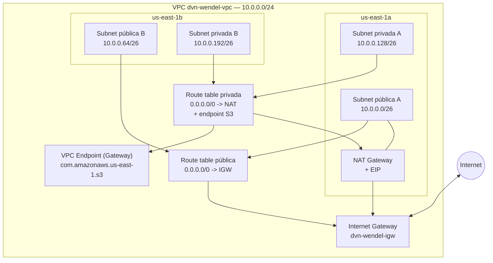

# ADR-001: Arquitetura de rede base na AWS (VPC /24, 4 subnets, NAT Gateway único)

| Campo | Valor |
|---|---|
| **Status** | Aprovado para Implementação  |
| **Data** | 2026-07-25 |
| **Autor** | Arquiteto de Soluções (agente) |
| **Aprovado por** | wendel |
| **Data da aprovação** | 2026-07-25 |
| **Escopo** | Workshop DVN — projeto `dvn-workshop-terraform_2`, conta AWS única, região `us-east-1`, ambiente de laboratório/dev |

> **Gate de implementação:** este ADR só pode ser implementado quando o status for
> `Aprovado para Implementação`.

## 1. Contexto

O repositório possui hoje um único stack Terraform em `dvn-workshop-terraform_2/` com:

- `main.tf` declarando apenas `aws_vpc.this` com tag `Name = "dvn-wendel-vpc"`;
- provider `hashicorp/aws` com constraint `~> 6.0`, resolvido em **6.56.0** no
  `.terraform.lock.hcl`; Terraform **1.13.5** conforme `terraform.tfstate`;
- região fixa em `us-east-1` diretamente no bloco `provider` (sem variável);
- `variables.tf` com `var.vpc.cidr_block` default `10.0.0.0/16`;
- `outputs.tf` expondo apenas `vpc_id`;
- **state local** (`terraform.tfstate` versionado no diretório) e atualmente **vazio**
  (`"resources": []`), ou seja, não há infraestrutura provisionada — não haverá
  recriação destrutiva de recursos existentes.

Existe também `dvn-workshop-julho/dvn-workshop-apps/` com `frontend/` e `backend/`, que
são as cargas de trabalho candidatas a consumir essa rede depois (frontend em subnet
pública / borda, backend em subnet privada). Não há ADRs anteriores, pipelines de CI/CD
nem Dockerfiles no repositório.

A decisão a tomar é o desenho da **rede base (landing zone mínima)** que servirá de
fundação para os próximos componentes (ALB, ECS/EC2, RDS), com o endereçamento já
definido pelo solicitante.

## 2. Requisitos

**Funcionais**

- VPC com CIDR `10.0.0.0/24`.
- 4 subnets `/26`, distribuídas em 2 Availability Zones:
  - Públicas: `10.0.0.0/26`, `10.0.0.64/26`
  - Privadas: `10.0.0.128/26`, `10.0.0.192/26`
- Subnets públicas com rota default para **Internet Gateway** (entrada e saída).
- Subnets privadas com **saída** para internet via **NAT Gateway único**, sem qualquer
  rota de entrada originada da internet.
- Outputs reutilizáveis por stacks futuros (`vpc_id`, IDs de subnets, route tables).

**Não funcionais**

- **Disponibilidade:** subnets em 2 AZs. Aceita-se que a **saída** das subnets privadas
  seja single-AZ (NAT único) — ver risco R1.
- **RTO/RPO:** rede é stateless e reconstruível por IaC; RTO alvo ≈ 15 min
  (`terraform apply` do zero), RPO não aplicável.
- **Custo-alvo:** manter a rede abaixo de ~US$ 40/mês em estado idle (principal driver:
  NAT Gateway).
- **Compliance:** sem requisito formal (ambiente de workshop). Ainda assim, aplicar
  baseline: sem recursos com IP público implícito, Flow Logs habilitados, default
  Security Group sem regras.
- **Escalabilidade de endereçamento:** o /24 é deliberadamente pequeno; ver premissa P4
  e risco R2.

## 3. Premissas

Confirmar cada item antes ou durante a revisão:

| # | Premissa |
|---|---|
| P1 | Região `us-east-1`, mantida do código atual; AZs `us-east-1a` (subnets `.0/26` e `.128/26`) e `us-east-1b` (`.64/26` e `.192/26`), resolvidas via `data.aws_availability_zones` em vez de hardcode. |
| P2 | Conta AWS única, ambiente de laboratório/dev. Não há requisito de SLA formal nem multi-conta (Control Tower / Organizations). |
| P3 | Somente **IPv4**. Sem dual-stack IPv6 nesta etapa. |
| P4 | O total de 256 endereços (≈ 236 utilizáveis, pois a AWS reserva 5 IPs por subnet) é suficiente: **59 IPs úteis por subnet**. Não é esperado EKS com IPs de pod na VPC (CNI padrão), que esgotaria esse espaço rapidamente. |
| P5 | Não há conectividade com on-premises, VPN, Direct Connect ou peering — logo, não há risco imediato de sobreposição de CIDR com outras redes. |
| P6 | O custo do NAT Gateway em horário fora de uso é aceitável; alternativamente, o workshop pode destruir o stack ao final do dia. |
| P7 | As aplicações em `dvn-workshop-apps` rodarão futuramente com o backend em subnets privadas e o ponto de entrada (ALB/CloudFront) nas públicas. |

## 4. Alternativas Consideradas

### 4.1 Estratégia de saída para subnets privadas

| Opção | Prós | Contras | Custo relativo | Veredito |
|---|---|---|---|---|
| **A. NAT Gateway único (1 AZ), route table privada compartilhada** | Menor custo; simples; atende ao pedido explícito | Falha de AZ derruba a saída das duas subnets privadas; tráfego cross-AZ da AZ-b é tarifado | ~US$ 33/mês + US$ 0,045/GB | **Escolhida** |
| B. NAT Gateway por AZ (2) | Alta disponibilidade real; sem tráfego cross-AZ | Dobra o custo fixo; mais recursos e EIPs | ~US$ 66/mês | Rejeitada — HA não é requisito e contraria o pedido |
| C. NAT Instance (t4g.nano) | Custo baixo (~US$ 3–4/mês); permite SNAT customizado | Instância a gerenciar (patch, AMI, monitoramento); throughput limitado; ponto único de falha aplicacional | ~US$ 5/mês | Rejeitada — troca custo por carga operacional indesejada |
| D. Sem NAT — apenas VPC Endpoints | Custo de egresso zero; superfície mínima | Bloqueia `apt`/`yum`, Docker Hub, APIs de terceiros; inviabiliza os labs | ~US$ 0–15/mês | Rejeitada como solução isolada; **adotada parcialmente** (endpoint S3, item 4.3) |

### 4.2 Forma de codificar em Terraform

| Opção | Prós | Contras | Custo relativo | Veredito |
|---|---|---|---|---|
| **E. Recursos nativos (`aws_vpc`, `aws_subnet`, …) com `for_each` sobre um mapa de subnets** | Coerente com o `main.tf` atual; controle total; valor didático (workshop); nada de abstração oculta | Mais código para manter; convenções por conta do time | — | **Escolhida** |
| F. Módulo `terraform-aws-modules/vpc/aws` | Maduro, testado, cobre casos de borda | Reescreve o stack atual; ~30 variáveis para um caso trivial; esconde o que o workshop quer ensinar; acopla a releases de terceiros | — | Rejeitada agora; reavaliar quando a rede virar multi-ambiente |
| G. Módulo local `modules/network` chamado pelo root | Reuso entre ambientes; interface explícita | Overhead para um único ambiente hoje | — | Rejeitada nesta etapa; caminho natural de evolução (ver §13) |

### 4.3 Route tables privadas

| Opção | Prós | Contras | Veredito |
|---|---|---|---|
| **H. Uma route table privada compartilhada pelas 2 subnets** | Menos recursos; simples | Amarra as duas AZs ao mesmo NAT (já é consequência do NAT único) | **Escolhida** |
| I. Uma route table por subnet privada | Facilita migrar para NAT-por-AZ depois, alterando só a rota | Recursos e código extras | Rejeitada — a migração para 2 NATs é de baixo esforço mesmo partindo de H |

Complemento adotado: **VPC Endpoint Gateway para S3** (sem custo por hora nem por GB),
associado à route table privada, para tirar o tráfego de S3 do NAT.

## 5. Decisão

Adotar a **Opção A + E + H**: uma VPC `10.0.0.0/24` em `us-east-1`, com 4 subnets `/26`
em 2 AZs (2 públicas com rota para Internet Gateway, 2 privadas com rota default para um
**único NAT Gateway** posicionado na subnet pública da primeira AZ), implementada com
**recursos Terraform nativos** iterados por `for_each`, mantendo o provider `~> 6.0` e o
padrão de nomes `dvn-wendel-*` já presente no repositório. Complementos de baseline:
Gateway Endpoint para S3, VPC Flow Logs e default Security Group sem regras.

Sustentação pelos pilares do **AWS Well-Architected Framework**:

- **Segurança:** segmentação público/privado explícita, ausência de rota de entrada nas
  subnets privadas, `map_public_ip_on_launch = false` (nada ganha IP público por
  acidente), default SG neutralizado, Flow Logs para auditoria de tráfego.
- **Excelência operacional:** 100% da rede em IaC versionada, nomes e tags padronizados,
  AZs resolvidas por data source (portável entre contas/regiões).
- **Otimização de custos:** um NAT em vez de dois economiza ~US$ 33/mês; o endpoint S3
  elimina custo de processamento de dados para o tráfego de S3.
- **Confiabilidade:** subnets em 2 AZs preservam a capacidade de rodar workloads
  multi-AZ; a limitação single-AZ fica restrita à saída NAT, e é decisão consciente,
  documentada no risco R1.
- **Eficiência de performance:** `/26` por subnet dimensiona o ambiente de workshop; o
  endpoint S3 encurta o caminho de dados para S3.
- **Sustentabilidade:** provisiona-se o mínimo de recursos necessários ao objetivo.

## 6. Arquitetura Proposta



**Plano de endereçamento**

| Subnet | CIDR | AZ (premissa P1) | Tipo | IPs utilizáveis | Rota default |
|---|---|---|---|---|---|
| `dvn-wendel-subnet-public-a` | `10.0.0.0/26` | us-east-1a | Pública | 59 | IGW |
| `dvn-wendel-subnet-public-b` | `10.0.0.64/26` | us-east-1b | Pública | 59 | IGW |
| `dvn-wendel-subnet-private-a` | `10.0.0.128/26` | us-east-1a | Privada | 59 | NAT (AZ-a) |
| `dvn-wendel-subnet-private-b` | `10.0.0.192/26` | us-east-1b | Privada | 59 | NAT (AZ-a, cross-AZ) |

Os quatro `/26` consomem integralmente o `/24` — **não sobra espaço para novas subnets**
(ex.: subnet dedicada de banco de dados ou de endpoints). Isso é aceito
deliberadamente; a mitigação está em R2.

**Fluxos de rede**

1. Entrada: Internet → IGW → subnet pública (futuro ALB) → subnet privada (aplicação),
   controlado por Security Groups.
2. Saída privada: instância/tarefa em subnet privada → route table privada → NAG na AZ-a
   → IGW → Internet. Origem da AZ-b atravessa AZ (tarifado como cross-AZ).
3. Saída para S3: subnet privada → Gateway Endpoint → S3, sem passar pelo NAT.
4. Não há rota de entrada da internet para as subnets privadas em nenhum cenário.

**Limites de rede (baseline)**

- `enable_dns_support = true`, `enable_dns_hostnames = true` (necessário para endpoints
  de interface e resolução privada futura).
- `map_public_ip_on_launch = false` em todas as subnets, inclusive as públicas: IP
  público passa a ser opt-in explícito no recurso que precisar (ALB, bastion, NAT).
- Default Security Group da VPC gerenciado via `aws_default_security_group` **sem
  nenhuma regra** de ingress/egress.
- NACLs mantidas no default (permissivas) — o controle fica nos Security Groups; ver
  §10.

## 7. Layout de Diretórios

Estrutura esperada no stack existente (nenhum diretório novo é criado nesta etapa). Nomes
de arquivo, de recursos, de variáveis e de outputs seguem a rule
`.kiro/rules/terraform-naming.md`: arquivos agrupados por domínio, identificadores em
`snake_case`, sem repetir o tipo do recurso no nome, `this` quando há um único recurso do
tipo.

```
dvn-workshop-terraform_2/
├── providers.tf         # terraform{} (required_version, required_providers), provider aws com default_tags
├── variables.tf         # entradas do stack (ver 7.2)
├── locals.tf            # local.name_prefix ("dvn-wendel") e local.tags derivadas
├── data.tf              # data.aws_availability_zones.available, data.aws_region.current
├── network.tf           # VPC, IGW, subnets, EIP, NAT Gateway, route tables, rotas e associações (ver 7.1)
├── endpoints.tf         # aws_vpc_endpoint.s3 (Gateway) associado à route table privada
├── observability.tf     # aws_flow_log.this, log group e IAM role/policy dos Flow Logs
├── security.tf          # aws_default_security_group.this sem regras
├── outputs.tf           # saídas do stack (ver 7.3)
├── terraform.tfvars     # valores do ambiente de workshop
├── .terraform.lock.hcl  # já existente — manter versionado, nunca editar à mão
└── terraform.tfstate*   # a remover do Git quando o backend remoto entrar (ver observações)
```

### 7.1 Endereços de recursos por arquivo

| Arquivo | Endereço Terraform | Regra aplicada |
|---|---|---|
| `network.tf` | `aws_vpc.this` | `this` — único recurso do tipo (já é o nome atual, preservar) |
| | `aws_internet_gateway.this` | `this` — único do tipo |
| | `aws_subnet.public` / `aws_subnet.private` | dois blocos com `for_each`, nomes descritivos no **singular**; não `subnets`, não `public_subnet` |
| | `aws_eip.nat` | descritivo, sem repetir o tipo (não `nat_eip`) |
| | `aws_nat_gateway.this` | `this` — único do tipo |
| | `aws_route_table.public` / `aws_route_table.private` | vários do mesmo tipo → nomes descritivos |
| | `aws_route.public_internet` / `aws_route.private_nat` | `snake_case`, sem repetir o tipo |
| | `aws_route_table_association.public` / `.private` | idem, com `for_each` sobre as subnets |
| `endpoints.tf` | `aws_vpc_endpoint.s3` | descritivo pelo serviço, não `s3_endpoint` |
| `observability.tf` | `aws_flow_log.this` | `this` — único do tipo |
| | `aws_cloudwatch_log_group.flow_log` | singular; identifica a finalidade |
| | `aws_iam_role.flow_log` / `aws_iam_role_policy.flow_log` | mesmo sufixo para o conjunto relacionado |
| | `data.aws_iam_policy_document.flow_log_assume` | `snake_case`, propósito explícito |
| `security.tf` | `aws_default_security_group.this` | `this` — único do tipo |
| `data.tf` | `data.aws_availability_zones.available` | nome de data source em `snake_case` |

Convenção adicional aplicada a todos os blocos: `for_each`/`count` como **primeiro**
argumento (seguido de linha em branco) e `tags` como **último** argumento real, antes de
`depends_on`/`lifecycle`.

### 7.2 Variáveis (`variables.tf`)

Nome, tipo e descrição espelham o argumento do recurso correspondente; plural para
`list`/`map`; ordem das chaves `description` → `type` → `default` → `validation`.

| Variável | Tipo | Observação de nomenclatura |
|---|---|---|
| `project` | `string` | usada em `default_tags` e no `local.name_prefix` |
| `environment` | `string` | com `validation` para `["dev", "hml", "prd"]` |
| `aws_region` | `string` | substitui a região hardcoded no `provider` |
| `vpc_cidr_block` | `string` | espelha o argumento `cidr_block` de `aws_vpc` (não `vpc_cidr`), com `validation` de CIDR |
| `public_subnets` | `map(object({ cidr_block, az_index }))` | **plural** por ser mapa; chaves `a`, `b` |
| `private_subnets` | `map(object({ cidr_block, az_index }))` | idem — mapas separados permitem `aws_subnet.public`/`aws_subnet.private` |
| `create_nat_gateway` | `bool` | booleano explícito para `count`, em vez de `length()` |
| `create_s3_endpoint` | `bool` | idem |
| `enable_flow_log` | `bool` | espelha a semântica de habilitar o recurso |
| `flow_log_retention_in_days` | `number` | espelha `retention_in_days` de `aws_cloudwatch_log_group` |

A variável `vpc` atual (objeto com `cidr_block`) é descontinuada: nome genérico demais e
sem `description`, contrariando a rule.

### 7.3 Outputs (`outputs.tf`)

Padrão `{name}_{type}_{attribute}`, com `{name}` omitido quando o recurso é `this`;
plural quando o retorno é lista ou mapa; `description` obrigatória.

| Output | Origem |
|---|---|
| `vpc_id`, `vpc_cidr_block` | `aws_vpc.this` (`{name}` omitido) |
| `internet_gateway_id` | `aws_internet_gateway.this` |
| `public_subnet_ids`, `private_subnet_ids` | **plural** — listas derivadas dos `for_each` |
| `nat_gateway_id` | `aws_nat_gateway.this` |
| `nat_eip_public_ip` | `aws_eip.nat` |
| `public_route_table_id`, `private_route_table_id` | route tables |
| `s3_vpc_endpoint_id` | `aws_vpc_endpoint.s3` |
| `default_security_group_id` | `aws_default_security_group.this` |
| `flow_log_cloudwatch_log_group_name` | `aws_cloudwatch_log_group.flow_log` |

O `output "vpc_id"` existente é mantido, apenas ganhando `description` (obrigatória pela
rule).

### 7.4 Observações de refatoração

- O `main.tf` atual deixa de concentrar tudo: o bloco `terraform`/`provider` vai para
  `providers.tf` e a VPC para `network.tf`. É movimentação de código entre arquivos, sem
  efeito no state — o endereço `aws_vpc.this` deve ser **preservado**.
- Se algum identificador de recurso já existente precisar mudar de nome, usar `moved`
  blocks (rule §6), nunca renomear direto — renomear implica destroy/create.
- Nomes de arquivo não são interpretados pelo Terraform (todo `.tf` do diretório é
  concatenado); a divisão acima é convenção de legibilidade definida na rule §5.
- `terraform.tfstate` e `terraform.tfstate.backup` estão versionados no repositório.
  Recomenda-se **backend S3 com lock nativo** (`use_lockfile`, suportado a partir do
  Terraform 1.10 e disponível no 1.13.5 em uso) e remoção do state do Git. Por ser uma
  decisão independente, deve virar o **ADR-002**; não está no escopo deste documento.

## 8. Plano de Implementação

Para o DevOps Engineer, após aprovação humana:

1. **Preparar variáveis e providers** — criar `providers.tf` com `required_version >= 1.13.0`,
   `required_providers` mantendo `hashicorp/aws ~> 6.0`, e `default_tags` no provider
   (`Project`, `Environment`, `ManagedBy = "terraform"`, `Owner`). Em `variables.tf`,
   substituir o objeto `vpc` atual pelas variáveis de §7.2, seguindo a rule
   `.kiro/rules/terraform-naming.md`.
   *Critério de aceite:* `terraform init -upgrade` e `terraform validate` sem erros;
   `terraform plan` não indica recriação da VPC (apenas mudança de tags/CIDR, ver passo 2);
   toda variável tem `description`.
   **Trecho ilustrativo — referência para o implementador, não a implementação final:**
   ```hcl
   variable "public_subnets" {
     description = "Subnets públicas da VPC, indexadas pelo sufixo da AZ"

     type = map(object({
       cidr_block = string
       az_index   = number
     }))

     default = {
       a = { cidr_block = "10.0.0.0/26",  az_index = 0 }
       b = { cidr_block = "10.0.0.64/26", az_index = 1 }
     }
   }

   # variable "private_subnets" segue a mesma forma, com 10.0.0.128/26 e 10.0.0.192/26
   ```

2. **Ajustar a VPC** — mover `aws_vpc.this` para `network.tf` mantendo o mesmo endereço
   de recurso, trocar o CIDR para `var.vpc_cidr_block` (`10.0.0.0/24`) e habilitar
   `enable_dns_support` / `enable_dns_hostnames`.
   *Dependência:* passo 1. *Atenção:* alterar `cidr_block` **força substituição** da VPC —
   confirmar no plan que o state não tem recursos dependentes (hoje está vazio, então é
   seguro).
   *Critério de aceite:* `terraform plan` mostra no máximo 1 replace/create de `aws_vpc`
   e nenhum recurso destruído fora disso.

3. **Criar Internet Gateway e subnets** — `aws_internet_gateway.this` anexado à VPC e dois
   blocos de subnet, `aws_subnet.public` (`for_each = var.public_subnets`) e
   `aws_subnet.private` (`for_each = var.private_subnets`), resolvendo a AZ por
   `data.aws_availability_zones.available.names[each.value.az_index]` e mantendo
   `map_public_ip_on_launch = false`.
   *Critério de aceite:* `aws ec2 describe-subnets --filters Name=vpc-id,Values=<vpc_id>`
   retorna exatamente os 4 CIDRs previstos, dois por AZ distinta, todos com
   `MapPublicIpOnLaunch: false`; endereços no state conforme §7.1.

4. **Provisionar EIP e NAT Gateway** — `aws_eip.nat` com `domain = "vpc"` e
   `aws_nat_gateway.this` (connectivity type `public`) na subnet
   `aws_subnet.public["a"]`, declarando `depends_on = [aws_internet_gateway.this]`.
   *Critério de aceite:* NAT com `State = available` e `SubnetId` = subnet `10.0.0.0/26`.

5. **Route tables e associações** — `aws_route_table.public` com
   `aws_route.public_internet` (`0.0.0.0/0 → IGW`) associada às 2 subnets públicas;
   `aws_route_table.private` com `aws_route.private_nat` (`0.0.0.0/0 → NAT`) associada às
   2 subnets privadas, via `aws_route_table_association.public` / `.private` com
   `for_each`.
   *Dependência:* passos 3 e 4.
   *Critério de aceite:* `describe-route-tables` mostra as rotas com estado `active` e 2
   associações em cada route table; nenhuma subnet permanece na route table **main**.

6. **VPC Endpoint para S3** — `aws_vpc_endpoint.s3` tipo `Gateway` para
   `com.amazonaws.us-east-1.s3` associado à route table privada.
   *Critério de aceite:* endpoint em estado `available` e prefix list de S3 presente nas
   rotas da route table privada.

7. **Baseline de segurança e observabilidade** — `aws_default_security_group.this` sem
   regras; `aws_flow_log.this` (tráfego `ALL`) para `aws_cloudwatch_log_group.flow_log`
   com `retention_in_days = var.flow_log_retention_in_days` (14) e
   `aws_iam_role.flow_log` de least privilege (apenas `logs:CreateLogStream`,
   `logs:PutLogEvents`, `logs:DescribeLogStreams` no ARN do log group).
   *Critério de aceite:* `describe-flow-logs` com `FlowLogStatus = ACTIVE`; default SG
   sem `IpPermissions` nem `IpPermissionsEgress`; log group recebendo eventos em até
   ~10 min.

8. **Outputs e validação funcional** — expor os outputs de §7.3, cada um com
   `description`. Validar egresso subindo temporariamente uma instância
   (ou tarefa) em `aws_subnet.private["a"]` com acesso via SSM e executando uma chamada
   HTTPS externa.
   *Critério de aceite:* saída para internet funciona da subnet privada; a instância
   **não** possui IP público; recurso de teste destruído ao final.

9. **Registro e handoff** — anexar ao PR a saída de `terraform plan`, o resultado dos
   critérios de aceite e abrir o ADR-002 (backend remoto de state).
   *Critério de aceite:* PR revisado e este ADR referenciado no commit.

## 9. Boas Práticas Aplicadas

- **Nomenclatura:** `dvn-wendel-<tipo>-<função>[-<az>]` (ex.: `dvn-wendel-subnet-private-b`,
  `dvn-wendel-rtb-private`), preservando o padrão do `main.tf` atual. Identificadores
  Terraform (nomes de recursos, variáveis, outputs e chaves de `for_each`) seguem
  snake_case conforme a rule `.kiro/rules/terraform-naming.md` (ver §7.1–§7.3).
- **Tags:** `default_tags` no provider (`Project`, `Environment`, `ManagedBy`, `Owner`) +
  tag `Name` por recurso; subnets recebem `Tier = public|private` para consumo por
  data sources futuros.
- **Versionamento:** provider pinado por constraint `~> 6.0` com `.terraform.lock.hcl`
  versionado; `required_version` declarado. Sem módulos de terceiros nesta etapa
  (Opção F rejeitada) — quando adotados, sempre com versão exata.
- **State remoto com lock:** hoje **não atendido** (state local versionado). Endereçado
  no ADR-002 proposto: backend S3 com versionamento, bucket privado, SSE-KMS e
  `use_lockfile = true`.
- **Separação de ambientes:** um único ambiente hoje; caminho previsto é extrair
  `modules/network` e usar diretórios/workspaces por ambiente.
- **IAM least privilege:** role dos Flow Logs restrita ao log group específico; nenhuma
  policy com `Resource = "*"`.
- **Segredos:** esta stack não manipula segredos; nada de credenciais em `.tf`/`.tfvars`
  (autenticação por perfil/role local ou OIDC no CI).
- **Observabilidade:** VPC Flow Logs com retenção definida; métricas do NAT Gateway
  (`BytesOutToDestination`, `ErrorPortAllocation`, `PacketsDropCount`) como base para
  alarmes futuros.
- **Testes de IaC:** `terraform fmt -check`, `terraform validate`, `terraform plan` em PR;
  sugerido adicionar `tflint` e `checkov`/`trivy config` quando houver pipeline.

## 10. Segurança e Compliance

**Superfície exposta à internet (sinalização explícita):**

- O **Internet Gateway** torna as duas subnets públicas alcançáveis pela internet para
  qualquer recurso que receba IP público ou seja um load balancer internet-facing.
  Mitigação adotada: `map_public_ip_on_launch = false` — a exposição passa a ser sempre
  uma escolha explícita no recurso, nunca um default da subnet.
- O **NAT Gateway** permite saída irrestrita das subnets privadas para qualquer destino
  na internet (`0.0.0.0/0`). Ele **não** cria caminho de entrada, mas também não filtra
  egresso. Se houver requisito de controle de saída, a evolução é AWS Network Firewall ou
  um proxy de egresso — fora do escopo por custo.
- **Nenhum recurso desta stack dispensa autenticação** — ela não cria endpoints
  aplicacionais. Qualquer serviço público futuro (ALB, API) deve tratar autenticação no
  seu próprio ADR.

**Criptografia:** não há dados em repouso nesta stack, exceto os logs de Flow Logs
(CloudWatch Logs, criptografados por padrão; KMS gerenciado pelo cliente é opcional e
não adotado por custo/complexidade em ambiente de lab). Tráfego em trânsito é
responsabilidade das camadas de aplicação (TLS no ALB/CloudFront).

**Autorização:** acesso administrativo aos recursos via IAM da conta; recomenda-se que a
execução do Terraform use role dedicada com permissões de EC2/VPC, não credenciais de
usuário de longa duração.

**Auditoria:** VPC Flow Logs (14 dias) + CloudTrail da conta (pré-existente, não
gerenciado aqui).

**Pontos de atenção:**

1. NACLs permanecem no default permissivo — controle efetivo depende de Security Groups
   bem escritos nas stacks de aplicação.
2. Egresso não filtrado (acima).
3. `terraform.tfstate` versionado no Git: state de rede não contém segredos hoje, mas o
   padrão é inseguro e deve ser corrigido no ADR-002 antes de a stack crescer (RDS,
   Secrets Manager).
4. Flow Logs `ALL` em ambiente com tráfego alto gera custo de ingestão — retenção curta
   já mitiga.

## 11. Custo Estimado

Ordem de grandeza mensal em `us-east-1`, considerando 730 h e uso leve de laboratório
(≈ 10 GB/mês pelo NAT). **Valores de referência a validar no AWS Pricing Calculator** —
não houve consulta a MCP/API de preços nesta sessão (ver §16).

| Componente | Base de cobrança | Estimativa/mês |
|---|---|---|
| NAT Gateway (1) | ~US$ 0,045/hora | ~US$ 33 |
| NAT Gateway — processamento de dados | ~US$ 0,045/GB | ~US$ 0,45 |
| Elastic IP do NAT (IPv4 público) | ~US$ 0,005/hora | ~US$ 3,65 |
| VPC, subnets, IGW, route tables | Sem custo | US$ 0 |
| VPC Endpoint Gateway (S3) | Sem custo | US$ 0 |
| VPC Flow Logs → CloudWatch Logs | Ingestão + armazenamento | ~US$ 1–3 |
| Tráfego cross-AZ (privada-b → NAT em AZ-a) | ~US$ 0,01/GB cada direção | < US$ 1 |
| **Total** | | **~US$ 38–41/mês** |

**Alavancas de otimização:**

- `terraform destroy` ao final de cada sessão do workshop elimina ~90% do custo.
- O endpoint S3 já retira o tráfego de S3 do NAT; avaliar endpoints de interface (ECR,
  SSM, Logs) somente se o volume justificar — eles custam ~US$ 7,20/mês por endpoint por
  AZ e podem sair mais caro que o NAT neste porte.
- Manter o NAT único (a opção B dobraria o custo fixo).
- Reduzir Flow Logs para `REJECT` ou destino S3 se a ingestão no CloudWatch incomodar.

## 12. Riscos e Mitigações

| Risco | Impacto | Probabilidade | Mitigação |
|---|---|---|---|
| **R1** — Falha da AZ-a derruba a saída de ambas as subnets privadas (NAT único) | Alto (perda de egresso; workloads na AZ-b afetados) | Baixa | Aceito por decisão de custo; migração para NAT-por-AZ é alteração pequena (recurso `for_each` + 2ª route table); documentar no runbook |
| **R2** — `/24` esgotado: os 4 `/26` consomem todo o espaço, sem margem para novas subnets ou crescimento | Médio-alto (bloqueia RDS em subnet dedicada, EKS, endpoints de interface) | Média | Se necessário, anexar CIDR secundário à VPC (`aws_vpc_ipv4_cidr_block_association`) em vez de recriar; evitar EKS com CNI padrão nesta VPC (P4) |
| **R3** — Alterar o `cidr_block` da VPC força substituição do recurso | Alto se houvesse dependências | Baixa | State está vazio hoje; executar o passo 2 antes de criar qualquer recurso dependente e validar no `plan` |
| **R4** — State local versionado: perda, conflito ou corrupção do `terraform.tfstate` | Alto (drift, recursos órfãos) | Média | Priorizar o ADR-002 (backend S3 + lock) logo após esta implementação; enquanto isso, um único operador por vez |
| **R5** — Custo do NAT esquecido ligado após o workshop | Baixo-médio (~US$ 37/mês) | Média | AWS Budget com alerta; rotina de `destroy` ao final |
| **R6** — Exaustão de portas do NAT (`ErrorPortAllocation`) em testes de carga | Médio | Baixa | Alarme CloudWatch na métrica; escalar para NAT adicional se ocorrer |
| **R7** — Recurso criado por engano com IP público em subnet pública | Médio (exposição) | Baixa | `map_public_ip_on_launch = false` + revisão de plan em PR |

## 13. Consequências

**Positivas**

- Fundação de rede padronizada e reprodutível, pronta para receber ALB, ECS/EC2 e RDS
  sem redesenho.
- Separação clara entre camadas pública e privada, com egresso controlado por um único
  ponto (facilita observar e, no futuro, filtrar).
- Custo previsível e baixo; nenhuma dependência de módulo de terceiros.
- Código coerente com o que já existe no repositório (provider, região, nomenclatura),
  o que preserva o valor didático do workshop.

**Negativas / dívida técnica assumida**

- Egresso privado é single-AZ (R1).
- Endereçamento sem folga: qualquer subnet nova exige CIDR secundário (R2).
- State permanece local até o ADR-002 (R4).
- NACLs default e egresso irrestrito — postura de segurança adequada a lab, insuficiente
  para produção regulada.
- Ausência de IPv6 e de módulo reutilizável: haverá refatoração quando surgir o segundo
  ambiente.

**Plano de rollback**

- Rede ainda não provisionada: `terraform destroy` remove tudo, na ordem inversa
  (associações → route tables → NAT → EIP → subnets → IGW → VPC).
- No código: reverter o PR restaura o `main.tf` anterior; como o `.terraform.lock.hcl`
  não muda de constraint, não há impacto de provider.
- Rollback parcial (ex.: manter VPC e remover apenas NAT/EIP) é possível comentando os
  recursos correspondentes — as subnets privadas perdem saída, mas nada mais quebra.
- Se o `destroy` falhar por dependência externa (ENI órfã de serviço gerenciado),
  identificar via `describe-network-interfaces` antes de repetir.

## 14. Decisão de Aprovação

_(preenchido pelo revisor humano — motivo em caso de `Não Aprovado`, ressalvas em caso
de aprovação)_

## 15. Histórico de Revisões

| Versão | Data | Alteração | Motivo |
|---|---|---|---|
| 1.0 | 2026-07-25 | Criação do ADR | Definir a arquitetura de rede base (VPC /24, 4 subnets, NAT único) para o workshop |
| 1.1 | 2026-07-25 | Chaves do mapa de subnets alteradas de kebab-case (`public-a`) para snake_case | Conformidade com a regra de identificadores sempre com `_` |
| 1.2 | 2026-07-25 | §7 reescrita com subseções 7.1 (endereços de recursos por arquivo), 7.2 (variáveis), 7.3 (outputs) e 7.4 (refatoração); mapa único de subnets dividido em `public_subnets`/`private_subnets` para permitir `aws_subnet.public`/`aws_subnet.private`; `vpc_cidr` renomeado para `vpc_cidr_block`; passos 1 a 8 do §8 alinhados aos novos endereços; referência de nomenclatura aponta para a rule | Alinhamento à rule `.kiro/rules/terraform-naming.md` (não repetir o tipo no nome do recurso, `this` para recurso único, plural em variáveis de mapa, outputs em `{name}_{type}_{attribute}`, variável espelhando o argumento do recurso) |

## 16. Referências

- AWS — VPC and subnet sizing (IPv4): reserva de 5 endereços por subnet.
  https://docs.aws.amazon.com/vpc/latest/userguide/subnet-sizing.html
- AWS — NAT gateways (posicionamento em subnet pública, dependência do IGW, métricas).
  https://docs.aws.amazon.com/vpc/latest/userguide/vpc-nat-gateway.html
- AWS — Gateway endpoints for Amazon S3 (sem custo horário/por GB).
  https://docs.aws.amazon.com/vpc/latest/privatelink/vpc-endpoints-s3.html
- AWS — VPC Flow Logs (publicação em CloudWatch Logs e IAM role necessária).
  https://docs.aws.amazon.com/vpc/latest/userguide/flow-logs.html
- AWS — Pricing: VPC (NAT Gateway, endpoints) e cobrança de IPv4 público.
  https://aws.amazon.com/vpc/pricing/ · https://aws.amazon.com/blogs/aws/new-aws-public-ipv4-address-charge-public-ip-insights/
- Terraform AWS Provider — `aws_vpc`, `aws_subnet`, `aws_nat_gateway`, `aws_eip`,
  `aws_route_table`, `aws_vpc_endpoint`, `aws_default_security_group`,
  `aws_flow_log`. https://registry.terraform.io/providers/hashicorp/aws/latest/docs
- Terraform — S3 backend com `use_lockfile` (lock nativo, Terraform ≥ 1.10).
  https://developer.hashicorp.com/terraform/language/backend/s3
- AWS Well-Architected Framework. https://docs.aws.amazon.com/wellarchitected/latest/framework/welcome.html
- Rule interna de nomenclatura: `.kiro/rules/terraform-naming.md`, derivada de
  https://www.terraform-best-practices.com/naming — base de §7.1, §7.2 e §7.3.
- HashiCorp — `moved` blocks (renomear recursos sem destruir).
  https://developer.hashicorp.com/terraform/language/moved
- Contexto do repositório inspecionado nesta sessão: `dvn-workshop-terraform_2/main.tf`,
  `variables.tf`, `outputs.tf`, `.terraform.lock.hcl` (aws 6.56.0),
  `terraform.tfstate` (Terraform 1.13.5, `resources: []`).

> **Nota de validação:** nesta sessão **não houve acesso a MCP (AWS/Terraform) nem
> execução de chamadas read-only à API AWS** — a tentativa de `aws sts get-caller-identity`
> / `describe-availability-zones` foi bloqueada pelo ambiente. Portanto, os itens a
> confirmar antes da implementação são: (a) preços vigentes de NAT Gateway, IPv4 público
> e CloudWatch Logs; (b) AZs efetivamente disponíveis na conta em `us-east-1`;
> (c) argumentos exatos dos recursos na versão 6.56.0 do provider (notadamente
> `aws_eip.domain` e `aws_vpc_endpoint.route_table_ids`).
