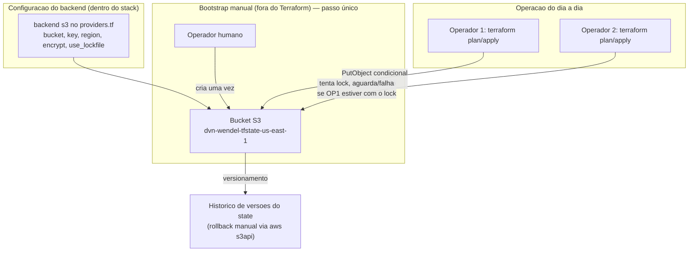

# ADR-002: Backend remoto S3 com lock nativo para o state Terraform

| Campo | Valor |
|---|---|
| **Status** | Aprovado para Implementação |
| **Data** | 2026-07-25 |
| **Autor** | Arquiteto de Soluções (agente) |
| **Aprovado por** | Wendel |
| **Data da aprovação** | 2026-07-25 |
| **Escopo** | Workshop DVN — bucket S3 dedicado a state, consumido pelo stack `dvn-workshop-terraform/01-networking-stack/` e por stacks futuros na mesma conta AWS, região `us-east-1` |

> **Gate de implementação:** este ADR só pode ser implementado quando o status for
> `Aprovado para Implementação`.

## 1. Contexto

O stack `dvn-workshop-terraform/01-networking-stack/` (implementado sob o ADR-001) usa
hoje **state local**: `terraform.tfstate` e `terraform.tfstate.backup` no próprio
diretório, sem backend configurado em `providers.tf`. Inspecionei o state atual
(`serial: 50`, `terraform_version: "1.13.5"`) e ele está com `"resources": []` no momento
desta análise — ou seja, não há recursos reais para importar agora, mas o arquivo já
teve 50 revisões (`serial`), evidenciando uso ativo durante a implementação do ADR-001.
Isso é uma janela favorável: migrar para backend remoto **antes** de o `apply` deixar
recursos consolidados no state evita a etapa de import/verificação pós-migração.

O ADR-001 já previa esta lacuna nos riscos R4 ("State local versionado: perda, conflito
ou corrupção") e na §7.4, remetendo a este documento. O stack antigo
`dvn-workshop-terraform_2/` também está em state local e vazio, mas está fora do escopo
operacional deste ADR — pode migrar depois, reaplicando o mesmo padrão.

Não há pipeline de CI/CD no repositório hoje: toda execução de Terraform é manual, feita
por quem estiver com as credenciais AWS no momento. Isso significa que o **risco de dois
operadores rodarem `apply` simultaneamente** é real e crescente à medida que mais pessoas
tocarem o repositório. Também não há controle de versão Git inicializado em
`/mnt/c/Users/WV/Pictures/workshop_ia` no momento desta análise — portanto o risco de
state versionado no Git (citado no ADR-001, risco R4) ainda não se materializou, mas a
migração para backend remoto deve ocorrer **antes** de qualquer `git init`/primeiro
commit, para nunca chegar a expor o state via Git.

O provider `hashicorp/aws` já está fixado em `~> 6.0` (resolvido em 6.56.0) e o Terraform
em uso é `1.13.5` — versão que suporta lock nativo do backend S3 via `use_lockfile`,
eliminando a necessidade de uma tabela DynamoDB separada (padrão anterior ao Terraform
1.10).

## 2. Requisitos

**Funcionais**

- Backend S3 para o state do stack `01-networking-stack` (e modelo replicável para
  stacks futuros).
- Lock de state para impedir `apply`/`plan` concorrentes corromperem o arquivo.
- Histórico de versões do state, para permitir reverter a um ponto anterior em caso de
  corrupção ou erro humano.
- Remoção de `terraform.tfstate*` do controle de versão Git.

**Não funcionais**

- **Disponibilidade:** S3 Standard tem SLA de 99,9% mensal — suficiente; não há
  requisito de state multi-região.
- **Segurança:** bucket privado, sem acesso público em nenhuma camada (Block Public
  Access, política de bucket, ACL), criptografia em repouso, acesso por IAM least
  privilege.
- **RPO do state:** versionamento do bucket permite recuperar qualquer revisão anterior;
  RPO efetivo é a cada `apply`/`plan -refresh-only` que gravar novo state.
- **Custo-alvo:** desprezível — armazenamento de poucos KB de JSON versionado.
- **Compatibilidade:** sem downtime ou impacto em infraestrutura já provisionada, já que
  o state atual está vazio.

## 3. Premissas

| # | Premissa |
|---|---|
| P1 | O state do `01-networking-stack` está vazio no momento da migração (confirmado por inspeção: `"resources": []`). Se um `apply` ocorrer entre a aprovação deste ADR e sua execução, o passo 1 do plano deve reconfirmar o state antes de prosseguir. |
| P2 | Região do bucket: `us-east-1`, mesma da infraestrutura de rede, para minimizar latência e evitar tráfego cross-region. Nome confirmado: `dvn-wendel-tfstate-us-east-1`. |
| P3 | Um único bucket serve a múltiplos stacks (rede, e futuramente ALB/ECS/RDS), diferenciados por `key` dentro do bucket — não é criado um bucket por stack. |
| P4 | Não há requisito de replicação cross-region para o state neste ambiente de workshop. |
| P5 | O bucket de state é criado **manualmente uma única vez** (bootstrap), fora do próprio Terraform que ele armazena — evita o problema clássico de "o backend do Terraform depender de um recurso gerenciado pelo mesmo Terraform". Ver §6 e alternativa rejeitada B. |
| P6 | Apenas os operadores humanos com credenciais AWS configuradas localmente executam `terraform init`/`plan`/`apply` — não há usuário de CI/CD a provisionar nesta etapa. |

## 4. Alternativas Consideradas

### 4.1 Backend

| Opção | Prós | Contras | Custo relativo | Veredito |
|---|---|---|---|---|
| **A. S3 + lock nativo (`use_lockfile = true`)** | Sem infra adicional; lock resolvido dentro do próprio S3 via `PutObject` condicional; suportado nativamente desde Terraform 1.10 (em uso: 1.13.5) | Exige Terraform ≥ 1.10 — já satisfeito | Mínimo (armazenamento de KBs) | **Escolhida** |
| B. S3 + DynamoDB (padrão pré-1.10) | Testado há anos; amplamente documentado | Recurso extra a manter, com seu próprio custo e superfície de IAM; redundante desde que `use_lockfile` existe | Baixo, mas maior que A | Rejeitada — sem motivo para manter o padrão legado com a versão do Terraform já atendendo ao nativo |
| C. Terraform Cloud / HCP Terraform (backend remoto gerenciado) | UI de execução, políticas, sem infra própria | Introduz dependência de conta externa à AWS; fora do escopo de "backend AWS" já em uso; custo e processo de onboarding não avaliados | Desconhecido | Rejeitada nesta etapa — reavaliar se o time crescer ou precisar de execução remota governada |
| D. Continuar com state local, apenas parar de versionar no Git | Menor esforço imediato | Não resolve lock concorrente nem histórico de versões; problema descrito no risco R4 do ADR-001 persiste | Nenhum | Rejeitada — não atende ao requisito funcional de lock |

### 4.2 Como o bucket de state é criado

| Opção | Prós | Contras | Veredito |
|---|---|---|---|
| **E. Bootstrap manual único (console ou `aws s3api create-bucket` executado uma vez por um humano), depois nunca mais gerenciado por Terraform** | Rompe a dependência circular "backend depende de recurso gerenciado pelo mesmo state que ele guarda"; simples | Fora de IaC — exige documentação clara do procedimento (§8) | **Escolhida** |
| F. Bucket criado por um Terraform separado ("stack 00-bootstrap"), com seu próprio state local | Tudo em IaC | Esse state de bootstrap continua sendo local — o problema apenas se move um nível acima, sem eliminá-lo | Rejeitada — não resolve o problema, apenas o desloca |
| G. Bucket criado dentro do próprio `01-networking-stack` | Um state a menos para gerenciar | Dependência circular real: para migrar o backend do stack para S3, o bucket precisa existir antes do backend apontar para ele; e o bucket, se gerenciado pelo mesmo state, cria uma referência circular na primeira execução | Rejeitada — anti-padrão documentado pela própria HashiCorp |

## 5. Decisão

Adotar a **Opção A + E**: criar um bucket S3 dedicado a state
(`dvn-wendel-tfstate-us-east-1`) via bootstrap manual único (fora de qualquer
Terraform), com versionamento, criptografia SSE-S3, Block Public Access total e política
restritiva exigindo TLS; migrar o backend do `01-networking-stack` para esse bucket
usando lock nativo (`use_lockfile = true`), sem tabela DynamoDB.

Pilares do **AWS Well-Architected Framework** que sustentam a escolha:

- **Confiabilidade:** lock nativo elimina corrupção por execução concorrente; versionamento do bucket permite recuperação de qualquer revisão do state.
- **Segurança:** bucket privado por padrão, criptografado, sem ACLs públicas, acesso via IAM least privilege — nenhuma superfície nova exposta à internet.
- **Excelência operacional:** remove o state do Git, elimina o risco de um `.gitignore` mal configurado expor state com ARNs, IPs e possíveis segredos de outros recursos futuros (RDS, Secrets Manager).
- **Otimização de custos:** custo de armazenamento do state é irrelevante (poucos KB); a alternativa nativa (A) evita o custo, ainda que pequeno, de uma tabela DynamoDB dedicada.

## 6. Arquitetura Proposta



**Fluxo de migração (visão lógica, detalhado em §8):**

1. Bucket criado manualmente, com as proteções de §10.
2. `providers.tf` do `01-networking-stack` ganha o bloco `backend "s3"`.
3. `terraform init -migrate-state` copia o state local existente para o bucket.
4. `terraform.tfstate*` local é removido do disco e do `.gitignore` deixa de precisar
   ignorá-lo (já não existirá mais ali).

**Limites de rede:** nenhum. O bucket S3 é acessado via API HTTPS pública da AWS
(endpoint regional do S3), autenticado por IAM — não há VPC envolvida nesta decisão. Se
desejado no futuro, o acesso pode ser restringido a um VPC Endpoint de S3 (o mesmo
padrão já usado no ADR-001 para tráfego de workload), mas isso é otimização de custo de
transferência, não requisito de segurança aqui.

## 7. Layout de Diretórios

Nenhum diretório novo de código é criado — a mudança é um bloco `backend` dentro do
providers.tf já existente, mais a documentação do procedimento de bootstrap. **Nota:**
`/mnt/c/Users/WV/Pictures/workshop_ia` não é hoje um repositório Git (confirmado por
inspeção: `git status` retorna "not a git repository"); os itens de `.gitignore`
abaixo são preparação para quando o repositório for inicializado, não remoção de
histórico existente.

```
dvn-workshop-terraform/
├── 01-networking-stack/
│   ├── providers.tf        # ganha o bloco backend "s3" {...}
│   ├── (demais arquivos inalterados: variables.tf, network.tf, endpoints.tf,
│   │    observability.tf, security.tf, outputs.tf, terraform.tfvars, locals.tf, data.tf)
│   ├── .terraform.lock.hcl  # inalterado — mesma constraint de provider
│   └── .gitignore          # NOVO —                                                                                                                          ignora .terraform/ e terraform.tfstate* remanescentes,
│                            #   valido a partir do momento em que o repositorio for versionado
└── 00-bootstrap-state/      # NOVO — apenas documentacao do procedimento manual, sem .tf
    └── README.md            # passo a passo do bootstrap (comandos aws s3api, nao Terraform)
```

O diretório `00-bootstrap-state/` **não contém código Terraform** — é documentação do
procedimento manual (Opção E), para não recriar a dependência circular rejeitada nas
opções F/G.

## 8. Plano de Implementação

Para o DevOps Engineer, após aprovação humana:

1. **Confirmar o estado atual do state** — reexecutar `terraform state list` em
   `01-networking-stack/` e comparar com a inspeção deste ADR (`"resources": []`).
   *Critério de aceite:* se houver recursos reais, documentar quais antes de migrar —
   `init -migrate-state` preserva o conteúdo, mas a verificação evita migrar um state
   inconsistente.

2. **Bootstrap manual do bucket (fora do Terraform)** — criar o bucket
   `dvn-wendel-tfstate-us-east-1` (nome confirmado pelo revisor humano em 2026-07-25),
   habilitar versionamento, SSE-S3, Block Public Access nas 4 configurações, e política
   de bucket negando qualquer acesso fora da conta e exigindo TLS
   (`aws:SecureTransport`). Documentar os comandos exatos em
   `00-bootstrap-state/README.md`.
   *Critério de aceite:* `aws s3api get-bucket-versioning`, `get-bucket-encryption` e
   `get-public-access-block` confirmam, respectivamente, `Status: Enabled`, SSE-S3 ativo
   e as 4 flags de bloqueio público em `true`.
   **Trecho ilustrativo — referência para o implementador, não a implementação final:**
   ```bash
   aws s3api create-bucket --bucket dvn-wendel-tfstate-us-east-1 --region us-east-1
   aws s3api put-bucket-versioning --bucket dvn-wendel-tfstate-us-east-1 \
     --versioning-configuration Status=Enabled
   aws s3api put-bucket-encryption --bucket dvn-wendel-tfstate-us-east-1 \
     --server-side-encryption-configuration \
     '{"Rules":[{"ApplyServerSideEncryptionByDefault":{"SSEAlgorithm":"AES256"}}]}'
   aws s3api put-public-access-block --bucket dvn-wendel-tfstate-us-east-1 \
     --public-access-block-configuration \
     BlockPublicAcls=true,IgnorePublicAcls=true,BlockPublicPolicy=true,RestrictPublicBuckets=true
   ```
   Se o nome colidir globalmente no momento da criação (S3 é namespace global), usar o
   Account ID como sufixo alternativo (`dvn-wendel-tfstate-us-east-1-<account-id>`) e
   atualizar este critério de aceite e o passo 3 com o nome final.

3. **Adicionar o bloco `backend "s3"`** em `providers.tf` do `01-networking-stack`, com
   `bucket`, `key = "01-networking-stack/terraform.tfstate"`, `region`, `encrypt = true`
   e `use_lockfile = true`. Não usar variáveis dentro do bloco `backend` — o Terraform não
   permite interpolação de `var.*` nessa configuração; os valores são literais ou vêm de
   um arquivo `-backend-config` separado.
   *Dependência:* passo 2. *Critério de aceite:* `terraform validate` não aponta erro de
   sintaxe no bloco backend (a validação completa só ocorre no `init`, passo 4).
   **Trecho ilustrativo — referência para o implementador, não a implementação final:**
   ```hcl
   terraform {
     backend "s3" {
       bucket       = "dvn-wendel-tfstate-us-east-1"
       key          = "01-networking-stack/terraform.tfstate"
       region       = "us-east-1"
       encrypt      = true
       use_lockfile = true
     }
   }
   ```

4. **Migrar o state** — executar `terraform init -migrate-state` dentro de
   `01-networking-stack/` e confirmar a cópia quando solicitado interativamente.
   *Dependência:* passos 2 e 3. *Critério de aceite:* Terraform reporta
   "Successfully configured the backend \"s3\"!"; `aws s3api list-object-versions`
   no bucket mostra o objeto `01-networking-stack/terraform.tfstate` criado;
   `terraform plan` local não mostra diffs além dos já esperados antes da migração.

5. **Remover o state local do disco e preparar o `.gitignore`** — apagar
   `terraform.tfstate` e `terraform.tfstate.backup` de `01-networking-stack/` (o
   `init -migrate-state` já cria um backup local antes de remover — confirmar antes de
   deletar manualmente); criar `.gitignore` cobrindo `.terraform/`, `terraform.tfstate*`,
   `*.tfplan`, `tfplan.out`. **Nota:** o diretório não está sob controle de versão Git
   hoje (confirmado por inspeção) — não há histórico a limpar; o `.gitignore` é
   preparação para quando/se o repositório vier a ser inicializado com `git init`, para
   que o state nunca seja commitado por descuido desde o primeiro commit.
   *Critério de aceite:* `.gitignore` existe e cobre os padrões acima; se e quando o
   repositório for inicializado, `git status` não deve listar `terraform.tfstate*` nem
   `.terraform/` como arquivos a versionar.

6. **Validar lock concorrente (teste funcional)** — em dois terminais, rodar
   `terraform plan` simultaneamente; o segundo deve aguardar ou falhar informando que o
   state está bloqueado pelo primeiro.
   *Critério de aceite:* mensagem de lock (`Error acquiring the state lock`) aparece no
   segundo terminal enquanto o primeiro ainda está em execução; após o primeiro
   terminar, o segundo prossegue normalmente.

7. **Documentar o procedimento de bootstrap** — `00-bootstrap-state/README.md` com os
   comandos do passo 2, o nome do bucket resultante, e a instrução de que **novos
   stacks devem reusar o mesmo bucket, variando apenas a `key`**.
   *Critério de aceite:* um novo stack hipotético consegue apontar para o mesmo bucket
   trocando apenas `key` no bloco `backend`, sem recriar infraestrutura de state.

8. **Replicar o padrão no stack legado (opcional, fora do escopo imediato)** —
   `dvn-workshop-terraform_2/` também está em state local; migrar quando esse stack for
   reativado ou descontinuado. Não é pré-requisito para este ADR.

## 9. Boas Práticas Aplicadas

- **State remoto com lock:** lock nativo do backend S3 (`use_lockfile`), sem componente
  adicional a operar — atende diretamente à lacuna registrada no ADR-001 §9.
- **Nomenclatura:** nome do bucket em kebab-case (`dvn-wendel-tfstate-us-east-1`),
  seguindo a convenção de valores de `.kiro/rules/terraform-naming.md` §5; `key` do state
  organizada por stack (`<nome-do-stack>/terraform.tfstate`), preparando o mesmo bucket
  para múltiplos stacks sem colisão.
- **Versionamento de provider:** inalterado — `hashicorp/aws ~> 6.0`, já fixado.
- **Separação de ambientes:** a `key` por stack já separa o state por unidade de
  implantação; se surgir mais de um ambiente (dev/hml/prd) para a mesma rede, a `key`
  deve incorporar o ambiente (`01-networking-stack/prd/terraform.tfstate`) — não coberto
  neste ADR porque o ADR-001 define um único ambiente até agora.
- **IAM least privilege:** operadores humanos precisam apenas de
  `s3:GetObject`/`PutObject`/`ListBucket` no prefixo do bucket relevante — não é
  necessário acesso de administrador ao bucket inteiro; detalhar a política em revisão
  se o número de operadores crescer.
- **Gestão de segredos:** o bucket não armazena segredos por si — mas o state de
  stacks futuros (RDS, Secrets Manager) pode conter atributos sensíveis; a criptografia
  em repouso do bucket (passo 2) já mitiga isso.
- **Testes de IaC:** `terraform plan` sem diffs inesperados imediatamente após a
  migração (passo 4) funciona como teste de regressão da migração.

## 10. Segurança e Compliance

**Superfície exposta à internet:** nenhuma nova. O bucket é acessado via API HTTPS
padrão do S3, autenticado por IAM; Block Public Access bloqueia qualquer tentativa de
tornar o bucket ou objetos públicos, mesmo por erro de configuração futura.

**Criptografia:**
- Em repouso: **SSE-S3** (chave gerenciada pela AWS, sem custo por chamada de API) —
  decisão confirmada pelo revisor humano em 2026-07-25. Suficiente para o volume e a
  sensibilidade atuais do state; se um stack futuro (RDS, Secrets Manager) exigir
  controle de chave próprio, reavaliar SSE-KMS em revisão específica.
- Em trânsito: TLS obrigatório via política de bucket (`aws:SecureTransport`), negando
  qualquer chamada HTTP não criptografado.

**Autenticação/autorização:** acesso via IAM da conta AWS. Não é criado usuário ou role
específico neste ADR — os operadores humanos usam suas credenciais/roles já
configuradas. Se o time crescer ou entrar CI/CD, uma role dedicada com policy restrita ao
prefixo do state deve ser criada em ADR próprio.

**Auditoria:** versionamento do bucket permite reconstituir o histórico de mudanças do
state; CloudTrail da conta (pré-existente) registra as chamadas `PutObject`/`GetObject`
no bucket, permitindo auditar quem alterou o state e quando.

**Pontos de atenção:**
1. O nome do bucket precisa ser globalmente único — se o sufixo sugerido colidir, o
   bootstrap falha e precisa de outro nome (documentar no README, não travar o ADR).
2. Bootstrap manual (Opção E) significa que o bucket **não é gerenciado por Terraform**
   — mudanças de configuração nele (versionamento, criptografia) exigem atualização
   manual ou, futuramente, um Terraform de "meta-infraestrutura" com seu próprio
   backend local isolado (aceitável, pois é um recurso único e estável).
3. O state local de antes da migração (`terraform.tfstate.backup` criado pelo próprio
   `init -migrate-state`) fica no disco do operador que executou a migração — deve ser
   tratado como sensível até confirmação de que a migração funcionou, e removido depois.

## 11. Custo Estimado

Ordem de grandeza mensal em `us-east-1` — **valores de referência a validar no AWS
Pricing Calculator**, sem consulta a MCP/API de preços nesta sessão:

| Componente | Base de cobrança | Estimativa/mês |
|---|---|---|
| Armazenamento S3 Standard (state + versões antigas, poucos KB a poucos MB) | ~US$ 0,023/GB | < US$ 0,01 |
| Requisições PUT/GET (poucos `plan`/`apply` por dia) | ~US$ 0,005/1000 PUT, ~US$ 0,0004/1000 GET | < US$ 0,10 |
| SSE-S3 | Sem custo adicional (incluído no armazenamento) | US$ 0 |
| **Total** | | **< US$ 0,20/mês** |

Alavanca de otimização: já aplicada — SSE-S3 em vez de SSE-KMS elimina o custo por
chamada de API de criptografia, irrelevante no volume deste workshop.

## 12. Riscos e Mitigações

| Risco | Impacto | Probabilidade | Mitigação |
|---|---|---|---|
| **R1** — Nome do bucket já existir globalmente (S3 é namespace global) | Baixo (bloqueia o bootstrap, não a infraestrutura já criada) | Média | README do bootstrap prevê sufixo alternativo (account ID ou aleatório) |
| **R2** — Bucket de state não é gerenciado por Terraform — drift de configuração (alguém desabilita versionamento manualmente) | Médio (perda de histórico de recuperação) | Baixa | Revisão periódica manual, ou futura automação via Terraform de meta-infraestrutura com backend local isolado |
| **R3** — Migração (`init -migrate-state`) falhar no meio do processo | Médio (state pode ficar inconsistente entre local e remoto) | Baixa | Passo 5 preserva backup local até confirmação; nunca apagar o backup antes do `plan` pós-migração dar limpo |
| **R4** — Dois operadores humanos sem lock hoje já rodam `apply` simultaneamente antes da migração ser aprovada | Médio (corrupção do state atual) | Baixa | Comunicação informal da janela de migração; após aprovação, executar o quanto antes |
| **R5** — Custo de chamadas KMS se SSE-KMS for escolhido e o volume de `plan`/`apply` crescer com CI/CD futuro | Baixo | Baixa | Reavaliar SSE-S3 vs SSE-KMS quando/se entrar pipeline automatizado |
| **R6** — Perda de acesso ao bucket (política mal configurada) bloqueia todo `plan`/`apply` subsequente | Alto (paralisa qualquer operação de Terraform) | Baixa | Testar a política com uma chamada de leitura/escrita imediatamente após o bootstrap (passo 2), antes de migrar qualquer stack |

## 13. Consequências

**Positivas**

- Elimina o risco de corrupção por execução concorrente do Terraform (lock nativo).
- Remove state do Git, junto com o risco de futuros segredos (RDS, Secrets Manager)
  vazarem via histórico do repositório.
- Um único bucket serve todos os stacks futuros, sem replicar infraestrutura de state a
  cada novo ambiente.
- Custo irrelevante frente ao benefício de confiabilidade.

**Negativas / dívida técnica assumida**

- O bucket de state não é gerenciado por Terraform — é a única peça de infraestrutura
  do repositório fora de IaC, por decisão deliberada (Opção E) para evitar dependência
  circular.
- Operadores humanos precisam lembrar de usar `-backend-config` ou editar `providers.tf`
  diretamente se o nome do bucket mudar — não há automação de descoberta.
- O stack legado `dvn-workshop-terraform_2/` continua em state local até ser migrado
  separadamente (fora do escopo aqui).

**Plano de rollback**

- Antes da remoção do state local (passo 5): reverter é apenas remover o bloco
  `backend` do `providers.tf` e rodar `terraform init -migrate-state` novamente,
  copiando de volta para local.
- Depois da remoção do state local: o backup criado automaticamente por
  `init -migrate-state` (passo 5) é a fonte de rollback; também é possível baixar
  qualquer versão anterior do objeto no S3 (versionamento) e usá-la como state local.
- Em nenhum momento há destruição de infraestrutura provisionada — a migração afeta
  apenas onde o arquivo de state é armazenado, não os recursos AWS que ele descreve.

## 14. Decisão de Aprovação

_(preenchido pelo revisor humano — motivo em caso de `Não Aprovado`, ressalvas em caso
de aprovação)_

## 15. Histórico de Revisões

| Versão | Data | Alteração | Motivo |
|---|---|---|---|
| 1.0 | 2026-07-25 | Criação do ADR | Migrar o state do `01-networking-stack` de local para backend S3 com lock nativo, conforme lacuna registrada no ADR-001 (risco R4 e §7.4) |
| 1.1 | 2026-07-25 | Criptografia fixada em SSE-S3 (removida a alternativa SSE-KMS aberta); nome do bucket confirmado como `dvn-wendel-tfstate-us-east-1`; corrigida a premissa de que o repositório está sob Git — confirmado por inspeção que `/mnt/c/Users/WV/Pictures/workshop_ia` não é um repositório Git hoje, então §7 e o passo 5 do plano foram ajustados de "remover do Git" para "preparar `.gitignore` para quando o repositório for inicializado" | Decisões diretas do revisor humano (SSE-S3, nome do bucket) e correção de fato após verificação com `git status` |

## 16. Referências

- HashiCorp — S3 backend, incluindo `use_lockfile` (lock nativo, Terraform ≥ 1.10).
  https://developer.hashicorp.com/terraform/language/backend/s3
- HashiCorp — State locking (histórico do mecanismo com DynamoDB, hoje opcional).
  https://developer.hashicorp.com/terraform/language/state/locking
- AWS — Amazon S3 Block Public Access.
  https://docs.aws.amazon.com/AmazonS3/latest/userguide/access-control-block-public-access.html
- AWS — Versionamento de bucket S3.
  https://docs.aws.amazon.com/AmazonS3/latest/userguide/Versioning.html
- AWS — Requerer HTTPS via política de bucket (`aws:SecureTransport`).
  https://docs.aws.amazon.com/AmazonS3/latest/userguide/security-best-practices.html
- AWS — Pricing: S3 Standard, KMS. https://aws.amazon.com/s3/pricing/ ·
  https://aws.amazon.com/kms/pricing/
- AWS Well-Architected Framework.
  https://docs.aws.amazon.com/wellarchitected/latest/framework/welcome.html
- ADR-001 deste repositório — origem da lacuna (risco R4, §7.4) que este ADR resolve.
- Contexto inspecionado nesta sessão: `dvn-workshop-terraform/01-networking-stack/providers.tf`
  (backend ausente), `terraform.tfstate` (serial 50, `resources: []` no momento da
  análise), `.terraform.lock.hcl` (aws 6.56.0).

> **Nota de validação:** não houve acesso a MCP AWS/Terraform nem a preços atualizados
> nesta sessão. Confirmar antes da implementação: (a) versão mínima real do Terraform
> que suporta `use_lockfile` na conta em uso (documentada como 1.10+; em uso: 1.13.5,
> portanto compatível); (b) política de nomenclatura de bucket S3 já usada em outras
> contas da organização, se existir, para evitar duplicidade de convenção.
