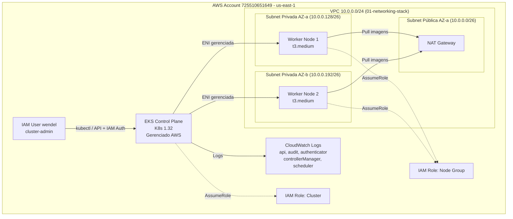

# ADR-003: Provisionamento de cluster EKS com Node Group On-Demand (02-eks-cluster-stack)

| Campo | Valor |
|---|---|
| **Status** | Aprovado para Implementação |
| **Data** | 2026-07-26 |
| **Autor** | Arquiteto de Soluções (agente) |
| **Aprovado por** | Wendel |
| **Data da aprovação** | 2026-07-26 |
| **Escopo** | Workshop DVN — stack `dvn-workshop-terraform/02-eks-cluster-stack/`, conta AWS `725510651649`, região `us-east-1`, ambiente `prd` |

> **Gate de implementação:** este ADR só pode ser implementado quando o status for
> `Aprovado para Implementação`.

## 1. Contexto

O repositório já possui a rede base provisionada pelo stack `01-networking-stack` (ADR-001): uma VPC `10.0.0.0/24` com 2 subnets privadas (`10.0.0.128/26` e `10.0.0.192/26`) em duas AZs (`us-east-1a` e `us-east-1b`), NAT Gateway único para saída à internet e backend remoto S3 (ADR-002).

O próximo passo é provisionar um **cluster Amazon EKS** para orquestrar as cargas de trabalho containerizadas existentes em `dvn-workshop-julho/dvn-workshop-apps/` (frontend e backend). O solicitante definiu:

- Instâncias **On-Demand** (sem Spot).
- Sizing **t3.medium** (2 vCPU, 4 GiB RAM).
- **2 worker nodes** suficientes para o workshop.
- **Logs do Control Plane** habilitados.
- **Versão mais recente** do Kubernetes disponível no EKS.
- Modos de autenticação **CONFIG_MAP e API** habilitados simultaneamente.
- O **usuário atual** (owner `wendel`) deve ter acesso de administrador ao cluster.

Não há cluster EKS existente, nem add-ons ou Helm charts pré-configurados. Este ADR cobre apenas o cluster e o node group gerenciado — add-ons (CoreDNS, kube-proxy, vpc-cni) serão provisionados na versão padrão do EKS.

## 2. Requisitos

**Funcionais**

- Cluster EKS com versão Kubernetes **1.32** (mais recente disponível no EKS em julho/2026).
- Managed Node Group com 2 instâncias `t3.medium` On-Demand nas subnets privadas.
- Logs do Control Plane habilitados (api, audit, authenticator, controllerManager, scheduler).
- Autenticação dual-mode: `CONFIG_MAP` + `API` (campo `authentication_mode = "API_AND_CONFIG_MAP"`).
- Acesso de cluster-admin para o usuário IAM atual via `aws-auth` ConfigMap e/ou access entry.
- Add-ons gerenciados pelo EKS: `vpc-cni`, `coredns`, `kube-proxy` nas versões padrão.
- Security Groups dedicados para o cluster e para os nodes.
- Endpoint do cluster privado + público (público restrito ao IP do operador ou aberto para workshop — ver Premissa P5).

**Não funcionais**

- **Disponibilidade:** nodes em 2 AZs; control plane gerenciado pela AWS (SLA 99.95%).
- **RTO/RPO:** cluster reconstruível via IaC em ~15 min; workloads são stateless nesta fase.
- **Custo-alvo:** ~US$ 150–180/mês (US$ 73 control plane + 2× t3.medium ~US$ 60 + NAT/transferência).
- **Segurança:** nodes em subnets privadas, sem IP público, IAM least privilege, envelope encryption com KMS para secrets do etcd é desejável mas opcional (ver alternativas).
- **Compliance:** ambiente de workshop, sem requisitos formais além de boas práticas.

## 3. Premissas

| # | Premissa |
|---|---|
| P1 | A VPC e subnets do `01-networking-stack` já estão provisionadas e acessíveis via `terraform_remote_state` ou `data sources`. |
| P2 | As subnets privadas possuem rota para internet via NAT Gateway (necessário para pull de imagens e comunicação com APIs AWS). |
| P3 | O CIDR `/24` com subnets `/26` (59 IPs úteis por subnet) é suficiente para 2 nodes t3.medium com ENIs secundárias do vpc-cni. Cada t3.medium suporta até 6 ENIs × 6 IPs = 36 IPs de pod por node. Com 2 nodes: ~72 IPs de pod, cabem nos 118 IPs úteis das 2 subnets privadas. |
| P4 | Kubernetes 1.32 está disponível como versão GA no EKS em `us-east-1` na data deste ADR. Caso não esteja, usar a versão GA mais recente disponível. |
| P5 | O endpoint público do cluster será habilitado para facilitar o acesso `kubectl` do operador no workshop. Em produção real, o endpoint deveria ser privado com acesso via VPN/bastion. **Superfície exposta à internet: endpoint API do Kubernetes.** Mitigação: autenticação IAM obrigatória. |
| P6 | O usuário IAM `wendel` é identificado via `data.aws_caller_identity.current` — o ARN obtido será adicionado como admin no cluster. |
| P7 | Não há necessidade de envelope encryption (KMS) para secrets do etcd neste workshop — reduz custo e complexidade. |
| P8 | As subnets precisarão das tags `kubernetes.io/cluster/<nome>: shared` e `kubernetes.io/role/internal-elb: 1` (privadas). Essas tags serão adicionadas pelo stack EKS ou requerem atualização no `01-networking-stack`. |

## 4. Alternativas Consideradas

### 4.1 Abordagem de provisionamento do cluster

| Opção | Prós | Contras | Custo relativo | Veredito |
|---|---|---|---|---|
| **A. Recursos nativos Terraform (`aws_eks_cluster`, `aws_eks_node_group`, IAM roles)** | Controle total; valor didático para workshop; sem dependência de módulo externo; coerente com stacks existentes (ADR-001 usou recursos nativos) | Mais código para manter; precisa cobrir IAM, SGs, add-ons manualmente | — | **Escolhida** |
| B. Módulo `terraform-aws-modules/eks/aws` | Maduro, cobre edge cases, IRSA integrado, testado em produção | Abstrai demais para workshop; ~50 variáveis; release coupling; curva para debug | — | Rejeitada — valor didático é prioridade |
| C. `eksctl` (CLI) | Rápido para criar cluster | Não é IaC declarativa; difícil versionamento e reprodutibilidade; fora do ecossistema Terraform do projeto | — | Rejeitada |

### 4.2 Tipo de compute para workers

| Opção | Prós | Contras | Custo relativo | Veredito |
|---|---|---|---|---|
| **D. Managed Node Group On-Demand (t3.medium)** | Previsível; sem interrupções; AMI gerenciada pela AWS; drain automático em updates; atende ao pedido explícito | Custo mais alto que Spot | ~US$ 60/mês (2 nodes) | **Escolhida** |
| E. Managed Node Group Spot (t3.medium + fallbacks) | Economia de ~60-70% | Interrupções possíveis; complexidade de fallback instance types; não adequado para workshop estável | ~US$ 20/mês | Rejeitada — estabilidade prioritária |
| F. Fargate profiles | Sem nodes para gerenciar; pay-per-pod | Limitações (daemonsets, volumes, GPUs); pricing pode ser maior com poucos pods; menos didático | Variável | Rejeitada |

### 4.3 Modo de autenticação

| Opção | Prós | Contras | Veredito |
|---|---|---|---|
| **G. `API_AND_CONFIG_MAP`** | Compatibilidade com aws-auth ConfigMap legado + novo sistema de Access Entries da API; flexibilidade máxima; atende ao pedido explícito | Dois mecanismos ativos simultaneamente podem confundir em ambientes grandes | **Escolhida** |
| H. `API` only | Mais limpo; Access Entries gerenciadas via Terraform/API | Quebra compatibilidade com ferramentas que dependem do ConfigMap | Rejeitada |
| I. `CONFIG_MAP` only | Legado, amplamente documentado | Deprecated path; sem Access Entries; requer kubectl para gerenciar permissões | Rejeitada |

### 4.4 Encryption de secrets no etcd

| Opção | Prós | Contras | Custo relativo | Veredito |
|---|---|---|---|---|
| J. KMS envelope encryption | Segurança adicional para secrets at rest | +US$ 1/mês pela chave + latência mínima; complexidade de key policy | ~US$ 1/mês | Rejeitada para workshop (P7) |
| **K. Sem envelope encryption (padrão EKS)** | Simples; EKS já encripta o etcd com chave gerenciada internamente | Não há controle da chave pelo cliente | US$ 0 | **Escolhida** |

## 5. Decisão

Adotar a **Opção A** (recursos nativos Terraform) para provisionar um cluster EKS 1.32 com **Managed Node Group On-Demand** de 2 instâncias `t3.medium` nas subnets privadas da VPC existente, com autenticação dual-mode `API_AND_CONFIG_MAP`.

Justificativa pelos pilares do AWS Well-Architected Framework:

- **Excelência Operacional:** logs do control plane completos habilitados; IaC reprodutível; add-ons gerenciados pelo EKS reduzem carga de manutenção.
- **Segurança:** nodes em subnets privadas sem IP público; IAM roles com least privilege (cluster role e node role separadas); autenticação IAM para API server; Security Groups restritivos.
- **Confiabilidade:** nodes distribuídos em 2 AZs; control plane gerenciado pela AWS com SLA 99.95%; managed node group com drain automático.
- **Eficiência de Performance:** t3.medium adequado para workloads de workshop; burstable credits suficientes para cargas intermitentes.
- **Otimização de Custos:** On-Demand sem commitment é adequado para workshop de curta duração (destroy ao final); sem KMS adicional; sem NAT extra.
- **Sustentabilidade:** rightsizing com 2 nodes mínimos; sem over-provisioning.

## 6. Arquitetura Proposta

### Diagrama de componentes



### Fluxo de rede

1. **Control Plane → Nodes:** via ENIs gerenciadas pelo EKS injetadas nas subnets privadas (SG do cluster permite saída para SG dos nodes nas portas 443 e 1025-65535).
2. **Nodes → Control Plane:** porta 443 via endpoint privado do cluster.
3. **Nodes → Internet:** via NAT Gateway na subnet pública (pull de imagens, APIs externas).
4. **Operador → API Server:** endpoint público do cluster, autenticado via IAM (aws-iam-authenticator / `aws eks get-token`).

### Componentes provisionados por este stack

| Recurso | Nome (tag Name) | Propósito |
|---|---|---|
| `aws_eks_cluster` | `dvn-wendel-eks` | Control plane Kubernetes 1.32 |
| `aws_eks_node_group` | `dvn-wendel-eks-ng-on-demand` | 2 workers t3.medium On-Demand |
| `aws_eks_addon` (×3) | vpc-cni, coredns, kube-proxy | Networking e DNS do cluster |
| `aws_iam_role` (cluster) | `dvn-wendel-role-eks-cluster` | Permissões do control plane |
| `aws_iam_role` (node) | `dvn-wendel-role-eks-node` | Permissões dos worker nodes |
| `aws_iam_role_policy_attachment` (×N) | — | Políticas gerenciadas AWS anexadas |
| `aws_eks_access_entry` | — | Acesso admin do usuário atual |
| `aws_eks_access_policy_association` | — | Associa AmazonEKSClusterAdminPolicy |
| `aws_security_group` (cluster) | `dvn-wendel-sg-eks-cluster` | Tráfego control plane |
| `aws_security_group` (node) | `dvn-wendel-sg-eks-node` | Tráfego dos workers |
| `aws_security_group_rule` (×N) | — | Regras de ingress/egress |
| `aws_cloudwatch_log_group` | `/aws/eks/dvn-wendel-eks/cluster` | Retenção dos logs do CP |

## 7. Layout de Diretórios

```
dvn-workshop-terraform/
└── 02-eks-cluster-stack/
    ├── providers.tf                    # Terraform/provider config, backend S3 (key: 02-eks-cluster-stack/terraform.tfstate)
    ├── data.tf                         # data sources: remote_state do 01-networking, caller_identity, AZs
    ├── locals.tf                       # Valores derivados (cluster name, log group name, subnet tags, etc.)
    ├── variables.tf                    # Variáveis do stack (cluster config, node group config, tags)
    ├── eks.cluster.tf                  # aws_eks_cluster: control plane, access config, log types
    ├── eks.cluster.iam.tf              # IAM role do cluster + policy attachments (AmazonEKSClusterPolicy)
    ├── eks.cluster.sg.tf               # Security group do cluster + regras de ingress/egress do control plane
    ├── eks.cluster.observability.tf    # CloudWatch Log Group para logs do control plane (retenção configurável)
    ├── eks.cluster.node-group.tf       # aws_eks_node_group: On-Demand, t3.medium, scaling config
    ├── eks.cluster.node-group.iam.tf   # IAM role dos nodes + policy attachments (WorkerNode, CNI, ECR)
    ├── eks.cluster.node-group.sg.tf    # Security group dos nodes + regras inter-node e cluster↔node
    ├── eks.cluster.addons.tf           # aws_eks_addon: vpc-cni, coredns, kube-proxy
    ├── eks.cluster.access.tf           # aws_eks_access_entry + policy association (admin do usuário atual)
    ├── eks.cluster.tags.tf             # aws_ec2_tag nas subnets (kubernetes.io/cluster/*, internal-elb)
    ├── outputs.tf                      # Outputs: cluster endpoint, name, certificate, OIDC, node role ARN
    └── terraform.tfvars                # Valores concretos do ambiente
```

**Convenção de nomenclatura dos arquivos:** `<domínio>.<subdomínio>.<aspecto>.tf` — permite identificar visualmente a que componente cada arquivo pertence e agrupar por prefixo no explorador de arquivos. Arquivos transversais ao stack (`providers.tf`, `data.tf`, `locals.tf`, `variables.tf`, `outputs.tf`, `terraform.tfvars`) mantêm o padrão existente nos outros stacks.

## 8. Plano de Implementação

### Passo 1 — Criar estrutura do stack e configurar backend remoto

- Criar diretório `dvn-workshop-terraform/02-eks-cluster-stack/`.
- Criar `providers.tf` com `required_version >= 1.13.0`, provider `hashicorp/aws ~> 6.0`, backend S3 com key `02-eks-cluster-stack/terraform.tfstate` no bucket `dvn-wendel-tfstate-us-east-1`.
- Configurar `default_tags` seguindo o padrão do `01-networking-stack`, com tag `ADR = "ADR-003"`.
- **Critério de aceite:** `terraform init` executa sem erros; state remoto acessível.

### Passo 2 — Criar data sources para consumir outputs da networking stack

- Em `data.tf`: `data "aws_caller_identity" "current"` e `terraform_remote_state` apontando para o state do `01-networking-stack` (mesmo bucket, key `01-networking-stack/terraform.tfstate`).
- Extrair: `vpc_id`, `private_subnet_ids`, IDs necessários.
- **Critério de aceite:** `terraform plan` resolve os data sources sem erro.

### Passo 3 — Criar IAM role do cluster

- Em `eks.cluster.iam.tf`:
  - Role `dvn-wendel-role-eks-cluster` com trust policy para `eks.amazonaws.com`; attach `AmazonEKSClusterPolicy`.
- **Critério de aceite:** `terraform plan` mostra criação de 1 role e 1 policy attachment.

### Passo 4 — Criar Security Group do cluster

- Em `eks.cluster.sg.tf`:
  - SG do cluster (`dvn-wendel-sg-eks-cluster`): ingress 443 do SG dos nodes; egress para SG dos nodes (1025-65535 e 443).
- **Critério de aceite:** regras referenciadas por SG ID (não por CIDR amplo); `terraform plan` sem erros.

### Passo 5 — Criar o cluster EKS

- Em `eks.cluster.tf`:
  - `aws_eks_cluster` com `version = "1.32"`, `role_arn` da cluster role, `vpc_config` com subnets privadas e SG do cluster, `endpoint_private_access = true`, `endpoint_public_access = true`.
  - `enabled_cluster_log_types = ["api", "audit", "authenticator", "controllerManager", "scheduler"]`.
  - `access_config { authentication_mode = "API_AND_CONFIG_MAP" }`.
- Em `eks.cluster.observability.tf`: `aws_cloudwatch_log_group` com nome `/aws/eks/dvn-wendel-eks/cluster` e retenção de 14 dias (criado antes do cluster para controlar retenção).
- **Critério de aceite:** `terraform plan` mostra 1 cluster + 1 log group; authentication_mode é `API_AND_CONFIG_MAP`; todos os 5 log types listados.

### Passo 6 — Configurar acesso admin para o usuário atual

- Em `eks.cluster.access.tf`:
  - `aws_eks_access_entry` com `principal_arn = data.aws_caller_identity.current.arn` e `type = "STANDARD"`.
  - `aws_eks_access_policy_association` associando a policy `arn:aws:eks::aws:cluster-access-policy/AmazonEKSClusterAdminPolicy` com scope `type = "cluster"`.
- **Critério de aceite:** `terraform plan` mostra access entry + policy association para o ARN do caller; acesso validável pós-apply com `kubectl get nodes`.

### Passo 7 — Criar IAM role dos nodes

- Em `eks.cluster.node-group.iam.tf`:
  - Role `dvn-wendel-role-eks-node` com trust policy para `ec2.amazonaws.com`; attach `AmazonEKSWorkerNodePolicy`, `AmazonEKS_CNI_Policy`, `AmazonEC2ContainerRegistryReadOnly`.
- **Critério de aceite:** `terraform plan` mostra criação de 1 role e 3 policy attachments; sem `*` em resource de policies customizadas.

### Passo 8 — Criar Security Group dos nodes

- Em `eks.cluster.node-group.sg.tf`:
  - SG dos nodes (`dvn-wendel-sg-eks-node`): ingress do SG do cluster (443, 1025-65535); ingress self (comunicação inter-node); egress 0.0.0.0/0 (pull de imagens via NAT).
- **Critério de aceite:** regras referenciadas por SG ID; `terraform plan` sem erros.

### Passo 9 — Criar o Managed Node Group

- Em `eks.cluster.node-group.tf`:
  - `aws_eks_node_group` com `instance_types = ["t3.medium"]`, `capacity_type = "ON_DEMAND"`, `scaling_config { desired_size = 2, min_size = 2, max_size = 2 }`, subnets privadas, node role ARN.
  - `ami_type = "AL2023_x86_64_STANDARD"` (Amazon Linux 2023 otimizado para EKS).
- **Critério de aceite:** `terraform plan` mostra 1 node group com 2 desired nodes, tipo ON_DEMAND, t3.medium.

### Passo 10 — Provisionar add-ons gerenciados

- Em `eks.cluster.addons.tf`:
  - `aws_eks_addon` para `vpc-cni`, `coredns`, `kube-proxy` com `resolve_conflicts_on_create = "OVERWRITE"` e sem versão fixa (usa o padrão do cluster).
- **Critério de aceite:** `terraform plan` mostra 3 add-ons; `resolve_conflicts` definido.

### Passo 11 — Adicionar tags nas subnets para descoberta pelo EKS

- Em `eks.cluster.tags.tf`:
  - `aws_ec2_tag` nas subnets privadas com `kubernetes.io/cluster/dvn-wendel-eks = shared` e `kubernetes.io/role/internal-elb = 1`.
  - `aws_ec2_tag` nas subnets públicas com `kubernetes.io/cluster/dvn-wendel-eks = shared` e `kubernetes.io/role/elb = 1`.
- **Critério de aceite:** subnets visíveis pelo EKS para alocação de ENIs e para service type LoadBalancer.

### Passo 12 — Validar e aplicar

- `terraform validate` e `terraform plan` completo.
- Após apply: `aws eks update-kubeconfig --name dvn-wendel-eks --region us-east-1` e `kubectl get nodes` deve retornar 2 nodes em estado Ready.
- Verificar logs no CloudWatch Log Group.
- **Critério de aceite:** cluster ACTIVE, 2 nodes Ready, logs fluindo, `kubectl` funcional para o operador.

## 9. Boas Práticas Aplicadas

- **Nomenclatura de arquivos:** `<domínio>.<subdomínio>.<aspecto>.tf` — agrupa visualmente por componente (ex.: `eks.cluster.tf`, `eks.cluster.iam.tf`, `eks.cluster.node-group.tf`). Arquivos transversais mantêm nome simples (`providers.tf`, `variables.tf`, `outputs.tf`).
- **Nomenclatura de identificadores:** segue `.kiro/rules/terraform-naming.md` — identificadores em `snake_case`, valores de tag Name em `kebab-case` com prefixo `dvn-wendel`.
- **Variáveis:** agrupadas por domínio conforme `.kiro/rules/terraform-variable-structure.md` — um objeto `cluster` e um objeto `node_group` em vez de variáveis isoladas.
- **Provider e versão:** `hashicorp/aws ~> 6.0`, Terraform `>= 1.13.0` — coerente com stacks existentes.
- **State remoto com lock:** backend S3 no mesmo bucket (`dvn-wendel-tfstate-us-east-1`) com `use_lockfile = true`.
- **Separação de stacks:** cluster isolado da rede; consome outputs via `terraform_remote_state` — alterações na rede não requerem re-apply do cluster e vice-versa.
- **IAM least privilege:** roles dedicadas (cluster e node) com apenas as managed policies obrigatórias da AWS; sem políticas inline com `*`.
- **Gestão de segredos:** nenhum segredo em código; autenticação via IAM nativa (token temporário via STS).
- **Tags padrão:** via `default_tags` — `Project`, `Environment`, `ManagedBy`, `Owner`, `ADR`.
- **Observabilidade:** todos os 5 log types do control plane habilitados com retenção configurável.
- **Versionamento explícito:** Kubernetes version fixada em `1.32` para evitar upgrades acidentais; upgrades são deliberados via alteração da variável.

## 10. Segurança e Compliance

### Superfície exposta à internet

| Componente | Exposição | Mitigação |
|---|---|---|
| EKS API Server (endpoint público) | **Sim** — acessível pela internet | Autenticação IAM obrigatória; sem acesso anônimo; pode restringir via `public_access_cidrs` |
| Worker Nodes | Não — subnets privadas, sem IP público | Saída apenas via NAT Gateway |
| Pods | Não — rede interna do cluster | Exposição futura via Ingress/LB será decisão separada |

### Controles aplicados

- **Criptografia em trânsito:** TLS obrigatório na comunicação kubelet ↔ API server (nativo EKS).
- **Criptografia em repouso:** etcd encriptado pela AWS com chave interna (padrão); EBS dos nodes encriptado por padrão (gp3 com SSE).
- **Autenticação:** IAM via STS tokens; dual-mode permite transição gradual de aws-auth para Access Entries.
- **Autorização:** RBAC do Kubernetes; access entry com `AmazonEKSClusterAdminPolicy` para o operador.
- **Rede:** Security Groups restritivos; nodes sem acesso direto da internet; comunicação inter-node limitada ao SG.
- **Auditoria:** logs `audit` e `authenticator` do control plane enviados ao CloudWatch para análise forense.
- **Sem segredos em código:** nenhuma credencial, token ou chave no repositório.

### Pontos de atenção

- O endpoint público do API server é uma concessão para facilitar o workshop. Em ambiente produtivo, restringir `public_access_cidrs` ou desabilitar o endpoint público.
- O `AmazonEKS_CNI_Policy` na node role dá permissão para gerenciar ENIs — necessário para vpc-cni, mas é um escopo amplo. Em evolução futura, considerar IRSA para isolar a permissão do CNI.

## 11. Custo Estimado

| Componente | Custo mensal estimado (us-east-1) | Observação |
|---|---|---|
| EKS Control Plane | ~US$ 73 | Fixo por cluster |
| 2× t3.medium On-Demand | ~US$ 60 | 2 × US$ 0,0416/h × 730h |
| NAT Gateway (data transfer dos nodes) | ~US$ 35–45 | Já existente; custo incremental depende do tráfego de pull |
| CloudWatch Logs (control plane) | ~US$ 5–10 | Depende do volume; 5 log types |
| EBS gp3 (20 GiB × 2 nodes) | ~US$ 3 | Root volume dos nodes |
| **Total incremental** | **~US$ 140–190/mês** | Sem NAT já existente: ~US$ 105–145 |

**Alavancas de otimização:**
- Destroy do cluster fora do horário do workshop (principal economia).
- Spot instances em iteração futura (reduz ~60% no custo de nodes).
- Reduzir log retention para 7 dias.
- Reserved Instances / Savings Plans se o cluster for permanente (não recomendado para workshop).

## 12. Riscos e Mitigações

| Risco | Impacto | Probabilidade | Mitigação |
|---|---|---|---|
| R1: Exaustão de IPs nas subnets /26 ao escalar pods | Pods em Pending; falha de scheduling | Baixa (2 nodes fixos, ~72 IPs de pod cabem nos 118 disponíveis) | Monitorar IP usage; se escalar, considerar CNI prefix delegation ou CIDR secundário |
| R2: Endpoint público do API server exposto | Superfície de ataque para brute force de tokens | Baixa (IAM auth obrigatório, sem bearer token anônimo) | Restringir `public_access_cidrs` ao IP do operador; desabilitar após workshop |
| R3: Falha do NAT Gateway (AZ-a) interrompe pull de imagens | Nodes não conseguem baixar imagens ou se comunicar com APIs AWS | Baixa (evento de AZ failure) | Imagens críticas já em cache nos nodes; reconstruir NAT na outra AZ se necessário |
| R4: Kubernetes 1.32 não disponível no EKS | Falha no plan/apply | Baixa (provável GA em jul/2026) | Fallback: usar 1.31; ajustar variável |
| R5: t3.medium insuficiente para workloads futuras | OOM ou CPU throttling | Média (depende das apps) | Monitorar via CloudWatch Container Insights; escalar para t3.large ou adicionar nodes |
| R6: Lock-in na AMI AL2023 | Incompatibilidade com workloads que requerem kernel/pacotes específicos | Baixa | Custom AMI via launch template se necessário |

## 13. Consequências

**Positivas:**
- Cluster EKS pronto para deploy das aplicações do workshop (frontend/backend).
- Infraestrutura 100% reprodutível via Terraform — destroy e recreate em ~15 min.
- Base preparada para add-ons futuros: AWS Load Balancer Controller, External DNS, Cluster Autoscaler.
- Autenticação dual-mode permite transição gradual para Access Entries sem breaking change.
- Logs completos do control plane disponíveis para troubleshooting desde o dia zero.

**Negativas / dívida técnica assumida:**
- Endpoint público do API server — aceito para o workshop, deve ser restrito em evolução para produção.
- Sem envelope encryption (KMS) — aceito por simplicidade; adicionar se houver requisito de compliance.
- Sem IRSA configurado — pods ainda usam a node role; isolar em ADR futuro quando deploy de apps ocorrer.
- Subnets tags adicionadas via `aws_ec2_tag` no stack EKS — acoplamento leve; idealmente estariam no stack de networking.
- Sem Cluster Autoscaler/Karpenter — scaling manual (2 nodes fixos); adequado para workshop.

**Plano de rollback:**
- `terraform destroy` no stack `02-eks-cluster-stack` remove todos os recursos EKS sem afetar a rede (`01-networking-stack` independente).
- As `aws_ec2_tag` nas subnets serão removidas junto; a rede permanece funcional.
- Tempo estimado de rollback: ~10 minutos.

## 14. Decisão de Aprovação

_(preenchido pelo revisor humano — motivo em caso de `Não Aprovado`, ressalvas em caso de aprovação)_

## 15. Histórico de Revisões

| Versão | Data | Alteração | Motivo |
|---|---|---|---|
| 1.0 | 2026-07-26 | Criação do ADR | Solicitação de provisionamento do cluster EKS |
| 1.1 | 2026-07-26 | Revisão do layout de arquivos: de nomes genéricos para padrão `eks.cluster.<aspecto>.tf` | Feedback do revisor — maior granularidade e organização visual por domínio |

## 16. Referências

- [Amazon EKS User Guide — Creating a cluster](https://docs.aws.amazon.com/eks/latest/userguide/create-cluster.html)
- [EKS Access Entries](https://docs.aws.amazon.com/eks/latest/userguide/access-entries.html)
- [EKS Authentication Modes](https://docs.aws.amazon.com/eks/latest/userguide/grant-k8s-access.html)
- [Terraform aws_eks_cluster resource](https://registry.terraform.io/providers/hashicorp/aws/latest/docs/resources/eks_cluster)
- [Terraform aws_eks_node_group resource](https://registry.terraform.io/providers/hashicorp/aws/latest/docs/resources/eks_node_group)
- [Terraform aws_eks_access_entry resource](https://registry.terraform.io/providers/hashicorp/aws/latest/docs/resources/eks_access_entry)
- [Terraform aws_eks_addon resource](https://registry.terraform.io/providers/hashicorp/aws/latest/docs/resources/eks_addon)
- [EKS Control Plane Logging](https://docs.aws.amazon.com/eks/latest/userguide/control-plane-logs.html)
- [EKS Managed Node Groups](https://docs.aws.amazon.com/eks/latest/userguide/managed-node-groups.html)
- [Amazon EKS Kubernetes versions](https://docs.aws.amazon.com/eks/latest/userguide/kubernetes-versions.html)
- [AWS Well-Architected Framework — EKS Lens](https://docs.aws.amazon.com/wellarchitected/latest/eks-lens/eks-lens.html)
- ADR-001: Arquitetura de rede base (VPC, subnets, NAT)
- ADR-002: Backend remoto S3 para Terraform state
