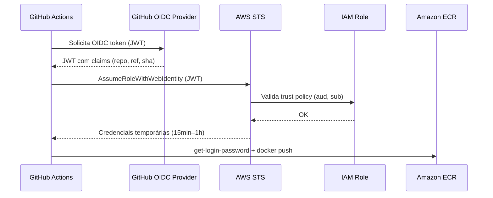

# ADR-004: OIDC Provider para Autenticação GitHub Actions na AWS

| Campo | Valor |
|---|---|
| **Status** | Aguardando Aprovação |
| **Data** | 2026-07-26 |
| **Autor** | Arquiteto de Soluções (agente) |
| **Aprovado por** | _(preenchido manualmente pelo revisor humano)_ |
| **Data da aprovação** | _(preenchido manualmente)_ |
| **Escopo** | Conta AWS 725510651649 / us-east-1 / CI-CD |

> **Gate de implementação:** este ADR só pode ser implementado quando o status for
> `Aprovado para Implementação`.

## 1. Contexto

A pipeline de deploy contínuo (ADR-005) executará em GitHub Actions e precisará interagir com recursos AWS (ECR para push de imagens). Atualmente não existe mecanismo de autenticação configurado entre o GitHub e a conta AWS.

O uso de chaves de acesso estáticas (IAM User + Access Keys) armazenadas como secrets no GitHub representa risco operacional: rotação manual, possibilidade de vazamento e ausência de auditoria granular por sessão.

A AWS oferece suporte a OIDC Federation, que permite que GitHub Actions assuma uma IAM Role temporariamente, sem necessidade de credenciais estáticas.

## 2. Requisitos

- **Funcionais:**
  - GitHub Actions deve poder autenticar na conta AWS 725510651649 sem chaves estáticas.
  - A autenticação deve restringir-se ao repositório correto (org/repo) e branch(es) específicos.
  - A role assumida deve ter permissão de push no ECR (repositórios `dvn-workshop/backend` e `dvn-workshop/frontend`).

- **Não funcionais:**
  - Segurança: sem segredos persistentes, credenciais temporárias com TTL curto.
  - Auditoria: cada execução deve gerar sessão rastreável no CloudTrail.
  - Least privilege: somente as permissões necessárias para o CI.

## 3. Premissas

| # | Premissa | Confirmável com |
|---|---|---|
| 1 | O repositório de aplicações está no GitHub (organização ou conta pessoal). | URL do repositório |
| 2 | O nome do repositório GitHub é `dvn-workshop-apps` (ou similar). | Confirmar com o usuário |
| 3 | O branch principal que dispara deploys é `main`. | Confirmar com o usuário |
| 4 | A conta AWS é `725510651649` (conforme visto nos ECR URLs). | Confirmado via manifests |
| 5 | A região é `us-east-1`. | Confirmado via tfvars |

## 4. Alternativas Consideradas

| Opção | Prós | Contras | Custo relativo | Veredito |
|---|---|---|---|---|
| **A) OIDC Provider + IAM Role** | Sem credenciais estáticas, sessões temporárias, auditável, integração nativa GH Actions | Configuração inicial (one-time) | Zero (sem custo AWS) | **Escolhida** |
| B) IAM User + Access Keys como GH Secrets | Simples de configurar | Risco de vazamento, rotação manual, sem sessão por execução, difícil auditoria | Zero | Descartada — risco operacional inaceitável |
| C) Self-hosted runner com Instance Profile | Sem credenciais no GH | Custo de infra do runner, manutenção, complexidade | ~$30/mês (t3.small 24/7) | Descartada — over-engineering para o cenário |

## 5. Decisão

Adotar **OIDC Identity Provider** no IAM para `token.actions.githubusercontent.com`, com uma **IAM Role dedicada** (`github-actions-ci-dvn-workshop`) que restringe o assume via conditions no trust policy (repositório + branch).

**Justificativa Well-Architected:**
- **Segurança:** elimina credenciais de longo prazo (SEC02-BP02, SEC02-BP05).
- **Excelência Operacional:** automação sem intervenção humana para rotação de credenciais.
- **Confiabilidade:** sem risco de expiração silenciosa de access keys.

## 6. Arquitetura Proposta



**Componentes:**
1. **IAM OIDC Identity Provider** — registra `token.actions.githubusercontent.com` como IdP confiável.
2. **IAM Role** (`github-actions-ci-dvn-workshop`) — role assumida pelo workflow.
3. **Trust Policy** — restringe por `sub` claim (repositório + branch).
4. **Permission Policy** — acesso ECR (push) e STS (get-caller-identity para validação).

## 7. Layout de Diretórios

```
dvn-workshop-terraform/
└── 03-ci-cd-iam-stack/
    ├── providers.tf          # Provider AWS, backend S3 remoto
    ├── variables.tf          # Variáveis: github_org, github_repo, etc.
    ├── terraform.tfvars      # Valores para o ambiente
    ├── data.tf               # Data sources (account ID, etc.)
    ├── locals.tf             # Composição de nomes
    ├── iam.oidc-provider.tf  # Recurso aws_iam_openid_connect_provider
    ├── iam.role.tf           # Role + Trust Policy + Permission Policy
    └── outputs.tf            # ARN da role (para uso no workflow)
```

## 8. Plano de Implementação

### Passo 1 — Criar o OIDC Identity Provider

**Recurso:** `aws_iam_openid_connect_provider`
- URL: `https://token.actions.githubusercontent.com`
- Audience (client_id_list): `sts.amazonaws.com`
- Thumbprint: GitHub publica a lista oficial; Terraform obtém automaticamente desde o provider AWS ≥ 4.x.

**Critério de aceite:** `aws iam list-open-id-connect-providers` retorna o ARN do provider criado.

**Trecho ilustrativo:**
```hcl
resource "aws_iam_openid_connect_provider" "github_actions" {
  url             = "https://token.actions.githubusercontent.com"
  client_id_list  = ["sts.amazonaws.com"]
  thumbprint_list = ["6938fd4d98bab03faadb97b34396831e3780aea1", "1c58a3a8518e8759bf075b76b750d4f2df264fcd"]
}
```

### Passo 2 — Criar a IAM Role com Trust Policy

**Recurso:** `aws_iam_role`
- Trust policy com condition `StringLike` no `sub` claim:
  - `repo:<GITHUB_ORG>/<GITHUB_REPO>:ref:refs/heads/main`
  - (ou `repo:<GITHUB_ORG>/<GITHUB_REPO>:*` se quiser qualquer branch — menos seguro)

**Critério de aceite:** `aws iam get-role --role-name github-actions-ci-dvn-workshop` retorna a role com a trust policy correta.

**Trecho ilustrativo:**
```hcl
resource "aws_iam_role" "github_actions" {
  name = "github-actions-ci-dvn-workshop"

  assume_role_policy = jsonencode({
    Version = "2012-10-17"
    Statement = [{
      Effect = "Allow"
      Principal = {
        Federated = aws_iam_openid_connect_provider.github_actions.arn
      }
      Action = "sts:AssumeRoleWithWebIdentity"
      Condition = {
        StringEquals = {
          "token.actions.githubusercontent.com:aud" = "sts.amazonaws.com"
        }
        StringLike = {
          "token.actions.githubusercontent.com:sub" = "repo:${var.github_org}/${var.github_repo}:ref:refs/heads/main"
        }
      }
    }]
  })
}
```

### Passo 3 — Criar a Permission Policy (ECR Push)

**Recurso:** `aws_iam_role_policy` ou `aws_iam_policy` + attachment.

Permissões necessárias:
- `ecr:GetAuthorizationToken` (em `*` — obrigatório)
- `ecr:BatchCheckLayerAvailability`, `ecr:GetDownloadUrlForLayer`, `ecr:PutImage`, `ecr:InitiateLayerUpload`, `ecr:UploadLayerPart`, `ecr:CompleteLayerUpload`, `ecr:BatchGetImage` — scoped nos ARNs dos repositórios.

**Critério de aceite:** `aws iam simulate-principal-policy` confirma que a role tem acesso aos repositórios ECR.

**Trecho ilustrativo:**
```hcl
resource "aws_iam_role_policy" "ecr_push" {
  name = "ecr-push-dvn-workshop"
  role = aws_iam_role.github_actions.id

  policy = jsonencode({
    Version = "2012-10-17"
    Statement = [
      {
        Sid    = "ECRAuth"
        Effect = "Allow"
        Action = ["ecr:GetAuthorizationToken"]
        Resource = "*"
      },
      {
        Sid    = "ECRPush"
        Effect = "Allow"
        Action = [
          "ecr:BatchCheckLayerAvailability",
          "ecr:GetDownloadUrlForLayer",
          "ecr:PutImage",
          "ecr:InitiateLayerUpload",
          "ecr:UploadLayerPart",
          "ecr:CompleteLayerUpload",
          "ecr:BatchGetImage"
        ]
        Resource = [
          "arn:aws:ecr:us-east-1:725510651649:repository/dvn-workshop/backend",
          "arn:aws:ecr:us-east-1:725510651649:repository/dvn-workshop/frontend"
        ]
      }
    ]
  })
}
```

### Passo 4 — Outputs

Exportar `role_arn` para ser usado como secret/variável no workflow GitHub Actions.

**Critério de aceite:** `terraform output github_actions_role_arn` retorna o ARN.

### Passo 5 — Validação end-to-end

Executar um workflow de teste no GitHub Actions que:
1. Usa `aws-actions/configure-aws-credentials@v4` com `role-to-assume`.
2. Executa `aws sts get-caller-identity`.
3. Verifica que o assumed-role ID contém `github-actions-ci-dvn-workshop`.

**Critério de aceite:** step de validação passa com status 0.

## 9. Boas Práticas Aplicadas

- **Nomenclatura:** role name em kebab-case com prefixo descritivo (`github-actions-ci-dvn-workshop`).
- **Tags:** `managed_by = "terraform"`, `adr = "ADR-004"`, `purpose = "ci-cd"`.
- **Provider versionado:** `hashicorp/aws >= 5.0` (suporte completo a OIDC thumbprint automático).
- **State remoto:** usar o mesmo backend S3 + DynamoDB já provisionado no ADR-002.
- **Lock de state:** habilitado via DynamoDB.
- **Least privilege:** policy scoped nos ARNs exatos dos repositórios ECR; trust policy restrita por repo+branch.
- **Sem secrets no código:** nenhuma credencial em `.tf` ou `.tfvars`.

## 10. Segurança e Compliance

| Aspecto | Decisão |
|---|---|
| Credenciais estáticas | **Eliminadas** — OIDC federation exclusivamente |
| Duração da sessão | Default 1h (configurável via `max_session_duration`) |
| Scope da trust policy | Restrito a repo + branch `main` |
| Auditoria | Cada `AssumeRoleWithWebIdentity` gera evento no CloudTrail |
| Criptografia | N/A (sem dados armazenados) |
| Exposição à internet | Nenhuma — IAM é control-plane AWS |
| Rotação | Não necessária — tokens são efêmeros |

**Ponto de atenção:** se o repositório mudar de nome ou organização, a trust policy precisa ser atualizada.

## 11. Custo Estimado

| Componente | Custo |
|---|---|
| IAM OIDC Provider | Gratuito |
| IAM Role | Gratuito |
| STS AssumeRoleWithWebIdentity | Gratuito |
| **Total** | **$0/mês** |

## 12. Riscos e Mitigações

| Risco | Impacto | Probabilidade | Mitigação |
|---|---|---|---|
| Trust policy muito permissiva (wildcard no sub) | Alto — qualquer branch/fork pode assumir a role | Média | Usar condition `StringLike` com `ref:refs/heads/main` explícito |
| Thumbprint do GitHub muda | Médio — AssumeRole falha | Baixa | AWS provider ≥ 5.x gerencia thumbprint automaticamente; monitorar falhas no CloudTrail |
| Repositório renomeado | Baixo — pipeline falha | Baixa | Documentar dependência; atualizar tfvars |
| Permissão ECR excessiva (ex.: ecr:DeleteRepository) | Alto — risco de deleção | Baixa | Policy limita a ações de push apenas |

## 13. Consequências

- **Positivas:**
  - Zero credenciais estáticas na organização GitHub.
  - Auditoria completa de cada execução CI via CloudTrail.
  - Alinhamento com AWS Well-Architected (pilar Segurança).
  - Sem custo adicional.

- **Negativas / dívida técnica assumida:**
  - Dependência de uma nova stack Terraform (`03-ci-cd-iam-stack`) que precisa ser aplicada antes da pipeline funcionar.
  - Se múltiplos repos precisarem acessar AWS, cada um requer ajuste na trust policy (ou pattern matching com wildcard controlado).

- **Plano de rollback:**
  - `terraform destroy` remove o OIDC provider e a role.
  - A pipeline perde acesso imediatamente (sem janela de risco).

## 14. Decisão de Aprovação

_(preenchido pelo revisor humano — motivo em caso de `Não Aprovado`, ressalvas em caso de aprovação)_

## 15. Histórico de Revisões

| Versão | Data | Alteração | Motivo |
|---|---|---|---|
| 1.0 | 2026-07-26 | Criação inicial | Solicitação do usuário |

## 16. Referências

- [GitHub OIDC — Configuring OpenID Connect in Amazon Web Services](https://docs.github.com/en/actions/security-for-github-actions/security-hardening-your-deployments/configuring-openid-connect-in-amazon-web-services)
- [AWS IAM OIDC Provider — Terraform Registry](https://registry.terraform.io/providers/hashicorp/aws/latest/docs/resources/iam_openid_connect_provider)
- [aws-actions/configure-aws-credentials](https://github.com/aws-actions/configure-aws-credentials)
- [AWS Well-Architected — SEC02-BP02](https://docs.aws.amazon.com/wellarchitected/latest/security-pillar/sec_identities_unique.html)
