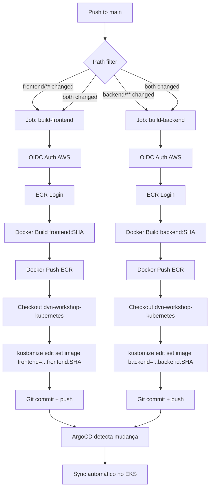

# ADR-005: Pipeline CI/CD com GitHub Actions — Build Condicional e Deploy GitOps

| Campo | Valor |
|---|---|
| **Status** | Aguardando Aprovação |
| **Data** | 2026-07-26 |
| **Autor** | Arquiteto de Soluções (agente) |
| **Aprovado por** | _(preenchido manualmente pelo revisor humano)_ |
| **Data da aprovação** | _(preenchido manualmente)_ |
| **Escopo** | Repositório dvn-workshop-apps / Conta AWS 725510651649 / us-east-1 |

> **Gate de implementação:** este ADR só pode ser implementado quando o status for
> `Aprovado para Implementação`.

## 1. Contexto

O projeto possui duas aplicações:
- **Frontend:** Next.js (porta 3000), imagem em `725510651649.dkr.ecr.us-east-1.amazonaws.com/dvn-workshop/frontend`.
- **Backend:** .NET 8 (porta 8080), imagem em `725510651649.dkr.ecr.us-east-1.amazonaws.com/dvn-workshop/backend`.

Os manifestos Kubernetes estão no repositório `dvn-workshop-kubernetes`, organizados com Kustomize. O ArgoCD (ADR-006) monitora esse repositório e faz deploy ao detectar alterações no `kustomization.yaml`.

Atualmente não existe pipeline automatizada. Builds e pushes são manuais. Precisamos de uma pipeline que:
1. Detecte qual app mudou e faça build apenas dela.
2. Faça push da imagem tagueada com o SHA do commit para o ECR.
3. Atualize o `kustomization.yaml` no repo `dvn-workshop-kubernetes` com a nova tag.
4. O ArgoCD detecta a mudança e faz sync automático.

A autenticação na AWS será via OIDC (ADR-004).

## 2. Requisitos

- **Funcionais:**
  - Trigger em push no branch `main`.
  - Job de frontend ativado **somente** se houve alteração em `frontend/` (path filter).
  - Job de backend ativado **somente** se houve alteração em `backend/` (path filter).
  - Login no ECR via OIDC.
  - Build da imagem Docker com tag `${{ github.sha }}` (SHA completo de 40 chars) e `latest`.
  - Push da imagem para o repositório ECR correspondente.
  - Após push bem-sucedido, atualizar o `kustomization.yaml` no repo `dvn-workshop-kubernetes` usando `kustomize edit set image`.
  - Commit e push da alteração no repo de manifests.

- **Não funcionais:**
  - Tempo de pipeline < 10min para single-app change.
  - Idempotência: re-execução com mesmo SHA não quebra nada (imagem já existe).
  - Segurança: sem credenciais estáticas, OIDC exclusivamente.
  - Observabilidade: logs claros de cada etapa, SHA rastreável.

## 3. Premissas

| # | Premissa | Confirmável com |
|---|---|---|
| 1 | O código das apps vive no repositório `dvn-workshop-apps` no GitHub. | URL do repo |
| 2 | Os manifests vivem no repositório separado `dvn-workshop-kubernetes`. | Estrutura confirmada localmente |
| 3 | A estrutura de diretórios das apps é `frontend/youtube-live-app/` e `backend/YoutubeLiveApp/`. | Confirmado via leitura do repo |
| 4 | O SHA usado na tag é o completo (`github.sha` = 40 chars). | Requisito do usuário |
| 5 | O ADR-004 (OIDC) estará implementado antes desta pipeline. | Dependência sequencial |
| 6 | O workflow terá permissão de escrita no repo `dvn-workshop-kubernetes` via deploy key ou PAT. | Confirmar mecanismo de autenticação cross-repo |
| 7 | O Kustomize CLI está disponível no runner (ubuntu-latest inclui ou será instalado). | Verificável |

## 4. Alternativas Consideradas

| Opção | Prós | Contras | Custo relativo | Veredito |
|---|---|---|---|---|
| **A) GitHub Actions com path filters + matrix** | Nativo do GH, sem custo extra, path filters built-in, paralelismo | Lógica de path filter em `on.push.paths` ou `dorny/paths-filter` | Gratuito (public repo) ou incluso no plano | **Escolhida** |
| B) GitHub Actions monorepo com Turborepo/nx | Change detection sofisticado | Over-engineering, dependência de tooling extra | Gratuito + complexidade | Descartada |
| C) AWS CodePipeline + CodeBuild | Integração nativa ECR, sem cross-account | Menos flexível, custo por build-minute, mais complexo de configurar | ~$5–15/mês | Descartada — GH Actions já é o CI escolhido |
| D) GitLab CI | Bom para monorepos | Não é a plataforma do projeto | N/A | Descartada |

**Decisão sobre path filter:**

| Abordagem de path filter | Prós | Contras | Veredito |
|---|---|---|---|
| **`on.push.paths`** nativo | Simples, zero deps | Não permite lógica condicional complexa; o workflow inteiro roda ou não | Limitada |
| **`dorny/paths-filter` action** | Granular por job, outputs reutilizáveis | Dependência de action terceira | Boa |
| **Jobs separados com `paths` no trigger + `if`** | Nativo, sem deps extras, cada job tem seu path | Dois workflows ou um com conditions | **Escolhida** |

Usaremos um **único workflow** com dois jobs independentes, cada um condicionado por path filter via `dorny/paths-filter` (action bem mantida, 4k+ stars, amplamente adotada) que emite outputs booleanos para gates dos jobs subsequentes.

## 5. Decisão

Implementar um **workflow GitHub Actions** (`ci-cd.yml`) com a seguinte estrutura:

1. **Job `changes`** — detecta quais paths mudaram.
2. **Job `build-frontend`** — condicional ao output de `changes`, faz build + push + update manifest.
3. **Job `build-backend`** — condicional ao output de `changes`, faz build + push + update manifest.

O workflow usa autenticação OIDC (ADR-004) para acessar o ECR. Após o push da imagem, faz checkout do repo de manifests, executa `kustomize edit set image` no diretório correto e faz commit+push.

**Justificativa Well-Architected:**
- **Excelência Operacional:** automação completa, sem intervenção manual para deploys.
- **Performance:** builds condicionais evitam trabalho desnecessário.
- **Segurança:** OIDC, sem secrets estáticas, imagens tagueadas com SHA imutável para rastreabilidade.
- **Confiabilidade:** pipeline idempotente, rollback via revert no repo de manifests.

## 6. Arquitetura Proposta



**Fluxo detalhado:**
1. Developer faz push em `main`.
2. Workflow detecta paths alterados.
3. Jobs relevantes autenticam via OIDC, fazem build, push ECR.
4. Jobs atualizam o `kustomization.yaml` no repo de manifests com a nova image tag (SHA).
5. ArgoCD (ADR-006) detecta o commit no repo de manifests e aplica no cluster.

## 7. Layout de Diretórios

```
dvn-workshop-apps/                  # Repositório das aplicações
├── .github/
│   └── workflows/
│       └── ci-cd.yml               # Workflow principal de CI/CD
├── frontend/
│   └── youtube-live-app/
│       ├── Dockerfile
│       └── ... (código Next.js)
└── backend/
    └── YoutubeLiveApp/
        ├── Dockerfile
        └── ... (código .NET 8)

dvn-workshop-kubernetes/            # Repositório de manifests (separado)
├── kustomization.yaml              # Root kustomization (resources: backend, frontend)
├── backend/
│   ├── kustomization.yaml          # Kustomization do backend
│   ├── deployment.yaml
│   ├── service.yaml
│   └── pdb.yaml
└── frontend/
    ├── kustomization.yaml          # Kustomization do frontend
    ├── deployment.yaml
    ├── service.yaml
    └── pdb.yaml
```

## 8. Plano de Implementação

### Passo 1 — Configurar acesso cross-repo

Para que o workflow no repo de apps possa fazer push no repo de manifests (`dvn-workshop-kubernetes`), configurar um dos mecanismos:

- **Opção recomendada:** GitHub App com permissão `contents: write` no repo de manifests, gerando um token efêmero via `actions/create-github-app-token`.
- **Opção alternativa:** Deploy Key (SSH) com permissão de escrita, armazenada como secret `DEPLOY_KEY_KUBERNETES_REPO`.
- **Opção simples (aceitável para repo pessoal):** PAT (Fine-Grained) com scope `contents: write` no repo de manifests, armazenado como secret `PAT_KUBERNETES_REPO`.

**Critério de aceite:** o workflow consegue fazer `git push` no repo de manifests.

### Passo 2 — Criar o workflow `ci-cd.yml`

**Arquivo:** `.github/workflows/ci-cd.yml` no repo `dvn-workshop-apps`.

**Estrutura ilustrativa:**

```yaml
name: CI/CD — Build & Deploy

on:
  push:
    branches: [main]

permissions:
  id-token: write    # Necessário para OIDC
  contents: read

env:
  AWS_REGION: us-east-1
  ECR_REGISTRY: 725510651649.dkr.ecr.us-east-1.amazonaws.com
  MANIFESTS_REPO: <org>/dvn-workshop-kubernetes

jobs:
  changes:
    runs-on: ubuntu-latest
    outputs:
      frontend: ${{ steps.filter.outputs.frontend }}
      backend: ${{ steps.filter.outputs.backend }}
    steps:
      - uses: actions/checkout@v4
      - uses: dorny/paths-filter@v3
        id: filter
        with:
          filters: |
            frontend:
              - 'frontend/**'
            backend:
              - 'backend/**'

  build-frontend:
    needs: changes
    if: needs.changes.outputs.frontend == 'true'
    runs-on: ubuntu-latest
    steps:
      - uses: actions/checkout@v4

      - name: Configure AWS Credentials (OIDC)
        uses: aws-actions/configure-aws-credentials@v4
        with:
          role-to-assume: arn:aws:iam::725510651649:role/github-actions-ci-dvn-workshop
          aws-region: ${{ env.AWS_REGION }}

      - name: Login to ECR
        uses: aws-actions/amazon-ecr-login@v2

      - name: Build & Push Frontend
        run: |
          IMAGE=${{ env.ECR_REGISTRY }}/dvn-workshop/frontend
          docker build -t ${IMAGE}:${{ github.sha }} \
                       -t ${IMAGE}:latest \
                       -f frontend/youtube-live-app/Dockerfile \
                       frontend/youtube-live-app
          docker push ${IMAGE}:${{ github.sha }}
          docker push ${IMAGE}:latest

      - name: Update Kubernetes Manifests
        run: |
          git clone https://x-access-token:${{ secrets.PAT_KUBERNETES_REPO }}@github.com/${{ env.MANIFESTS_REPO }}.git manifests
          cd manifests/frontend
          kustomize edit set image \
            725510651649.dkr.ecr.us-east-1.amazonaws.com/dvn-workshop/frontend=${{ env.ECR_REGISTRY }}/dvn-workshop/frontend:${{ github.sha }}
          cd ..
          git config user.name "github-actions[bot]"
          git config user.email "github-actions[bot]@users.noreply.github.com"
          git add .
          git commit -m "ci: update frontend image to ${{ github.sha }}"
          git push

  build-backend:
    needs: changes
    if: needs.changes.outputs.backend == 'true'
    runs-on: ubuntu-latest
    steps:
      - uses: actions/checkout@v4

      - name: Configure AWS Credentials (OIDC)
        uses: aws-actions/configure-aws-credentials@v4
        with:
          role-to-assume: arn:aws:iam::725510651649:role/github-actions-ci-dvn-workshop
          aws-region: ${{ env.AWS_REGION }}

      - name: Login to ECR
        uses: aws-actions/amazon-ecr-login@v2

      - name: Build & Push Backend
        run: |
          IMAGE=${{ env.ECR_REGISTRY }}/dvn-workshop/backend
          docker build -t ${IMAGE}:${{ github.sha }} \
                       -t ${IMAGE}:latest \
                       -f backend/YoutubeLiveApp/Dockerfile \
                       backend/YoutubeLiveApp
          docker push ${IMAGE}:${{ github.sha }}
          docker push ${IMAGE}:latest

      - name: Update Kubernetes Manifests
        run: |
          git clone https://x-access-token:${{ secrets.PAT_KUBERNETES_REPO }}@github.com/${{ env.MANIFESTS_REPO }}.git manifests
          cd manifests/backend
          kustomize edit set image \
            725510651649.dkr.ecr.us-east-1.amazonaws.com/dvn-workshop/backend=${{ env.ECR_REGISTRY }}/dvn-workshop/backend:${{ github.sha }}
          cd ..
          git config user.name "github-actions[bot]"
          git config user.email "github-actions[bot]@users.noreply.github.com"
          git add .
          git commit -m "ci: update backend image to ${{ github.sha }}"
          git push

```

**Critério de aceite:**
- Alteração apenas em `frontend/` dispara somente o job `build-frontend`.
- Alteração apenas em `backend/` dispara somente o job `build-backend`.
- Alteração em ambos dispara os dois jobs.
- Imagem aparece no ECR com a tag SHA.
- O `kustomization.yaml` no repo de manifests é atualizado com a nova tag.

### Passo 3 — Instalar Kustomize no runner

O runner `ubuntu-latest` do GitHub não inclui `kustomize` por padrão. Adicionar step:

```yaml
      - name: Install Kustomize
        uses: imranismail/setup-kustomize@v2
```

**Critério de aceite:** `kustomize version` retorna versão ≥ 5.x no log do job.

### Passo 4 — Testar pipeline end-to-end

1. Fazer push de alteração trivial em `frontend/`.
2. Verificar que apenas `build-frontend` executou.
3. Verificar imagem no ECR com tag SHA.
4. Verificar commit automático no repo de manifests.
5. Repetir para `backend/`.
6. Repetir alterando ambos.

**Critério de aceite:** 3 cenários validados com sucesso.

### Passo 5 — Tratamento de race condition (push simultâneo)

Se ambos os jobs tentam fazer push no repo de manifests ao mesmo tempo, pode haver conflito. Mitigação:

- Usar `git pull --rebase` antes do push.
- Ou serializar com `concurrency` no workflow.

**Trecho ilustrativo:**
```yaml
concurrency:
  group: manifest-update
  cancel-in-progress: false
```

Ou no step de push:
```bash
git pull --rebase origin main
git push
```

**Critério de aceite:** push simultâneo de ambos os jobs não causa falha.

## 9. Boas Práticas Aplicadas

- **Versionamento de Actions:** todas as actions pinadas em major version (`@v4`, `@v3`, `@v2`). Para produção real, pinar em SHA.
- **Permissions mínimas:** `id-token: write` + `contents: read` no nível do workflow. Nenhuma permission desnecessária.
- **Secrets:** apenas o PAT/deploy key para cross-repo push. Nenhuma credencial AWS como secret.
- **Tags imutáveis:** SHA como tag garante rastreabilidade exata do commit → imagem → deploy.
- **Separação de concerns:** repo de apps ≠ repo de manifests (padrão GitOps).
- **Observabilidade:** cada step nomeado descritivamente; SHA no commit message do manifest.
- **Idempotência:** re-push de mesma tag não causa erro (ECR com `MUTABLE` tags).

## 10. Segurança e Compliance

| Aspecto | Decisão |
|---|---|
| Autenticação AWS | OIDC exclusivamente (ADR-004) — zero secrets AWS |
| Cross-repo push | PAT Fine-Grained ou GitHub App token (scope mínimo: `contents: write` apenas no repo de manifests) |
| Imagens | Scan on push habilitado no ECR (já configurado no Terraform) |
| Runner | `ubuntu-latest` GitHub-hosted (sem acesso persistente) |
| Supply chain | Actions de fontes oficiais (aws-actions, dorny, imranismail) |
| Exposição | Nenhum recurso exposto; workflow roda em contexto do GitHub |

**Ponto de atenção:** o PAT para cross-repo precisa ter expiração definida e ser rotacionado. GitHub App token é preferível por ser efêmero.

## 11. Custo Estimado

| Componente | Custo |
|---|---|
| GitHub Actions (repo público) | Gratuito |
| GitHub Actions (repo privado) | 2.000 min/mês grátis (plano Free); ~$0.008/min excedente |
| ECR Storage (~200MB/imagem × 2 apps × builds) | ~$1–3/mês |
| ECR Transfer (push do GH runner) | Gratuito (internet → ECR) |
| **Total estimado** | **$1–5/mês** |

## 12. Riscos e Mitigações

| Risco | Impacto | Probabilidade | Mitigação |
|---|---|---|---|
| Race condition no push ao repo de manifests | Médio — um job falha | Média (quando ambos mudam) | `git pull --rebase` + retry ou `concurrency` group |
| `dorny/paths-filter` com breaking change | Baixo — pipeline falha | Baixa | Pinar versão exata; monitorar releases |
| Kustomize edit altera formato do YAML | Baixo — diff confuso | Baixa | Usar versão pinada do kustomize |
| ECR throttling em push | Baixo — retry resolve | Baixa | Docker push tem retry built-in |
| PAT expira sem renovação | Médio — pipeline para | Média | Alerta de expiração; preferir GitHub App |
| Imagem com SHA já existe (re-run) | Nenhum — ECR aceita overwrite (MUTABLE) | Alta (re-runs) | Comportamento esperado, sem ação |

## 13. Consequências

- **Positivas:**
  - Deploy totalmente automatizado em push para `main`.
  - Builds condicionais reduzem tempo e consumo de minutos.
  - Rastreabilidade completa: commit SHA → image tag → deployment.
  - Separação GitOps: pipeline nunca toca no cluster diretamente.

- **Negativas / dívida técnica assumida:**
  - Dependência do `dorny/paths-filter` (action de terceiro).
  - PAT como secret precisa de rotação manual (migrar para GitHub App no futuro).
  - Se ambos os apps mudam, dois commits separados no repo de manifests (aceitável).

- **Plano de rollback:**
  - Revert do commit no repo de manifests restaura a tag anterior.
  - ArgoCD faz sync para a imagem anterior automaticamente.
  - Para desabilitar a pipeline: remover o workflow file ou desabilitar no Settings do repo.

## 14. Decisão de Aprovação

_(preenchido pelo revisor humano — motivo em caso de `Não Aprovado`, ressalvas em caso de aprovação)_

## 15. Histórico de Revisões

| Versão | Data | Alteração | Motivo |
|---|---|---|---|
| 1.0 | 2026-07-26 | Criação inicial | Solicitação do usuário |

## 16. Referências

- [GitHub Actions — Workflow syntax: `on.push.paths`](https://docs.github.com/en/actions/using-workflows/workflow-syntax-for-github-actions#onpushpull_requestpull_request_targetpathspaths-ignore)
- [dorny/paths-filter](https://github.com/dorny/paths-filter)
- [aws-actions/configure-aws-credentials](https://github.com/aws-actions/configure-aws-credentials)
- [aws-actions/amazon-ecr-login](https://github.com/aws-actions/amazon-ecr-login)
- [Kustomize — edit set image](https://kubectl.docs.kubernetes.io/references/kustomize/cmd/edit/set/image/)
- [imranismail/setup-kustomize](https://github.com/imranismail/setup-kustomize)
- ADR-004: OIDC Provider para GitHub Actions (dependência)
- ADR-006: Instalação do ArgoCD no EKS (dependência downstream)
